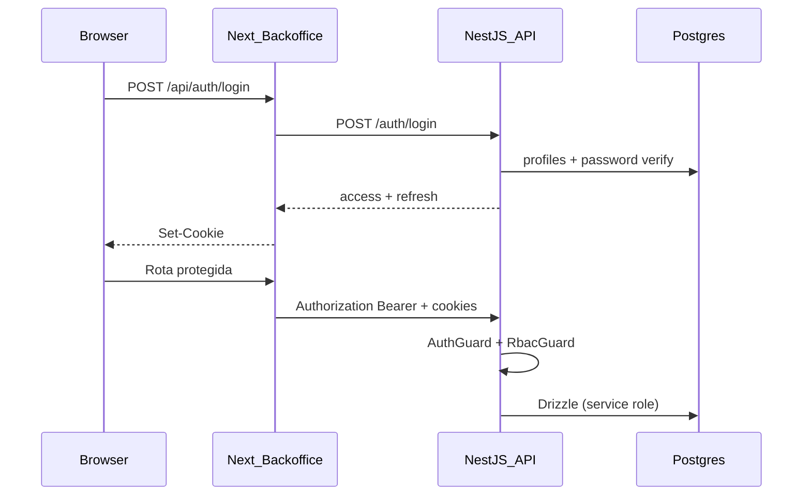
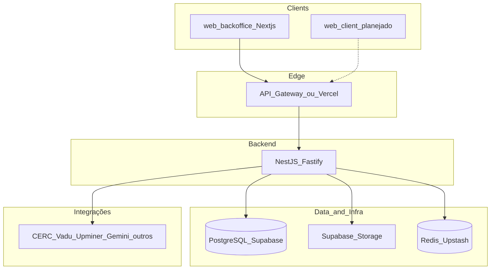
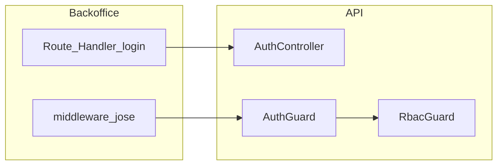

# Arquitetura do Sistema — Plataforma Sarfaty

**Versão:** 1.2  
**Data:** Março 2026  
**Status:** Draft  

---

## 1. Decisões Arquiteturais

### 1.1 Resumo das Decisões

| Decisão | Escolha | Justificativa |
|---------|---------|---------------|
| Estrutura do projeto | Monorepo (Turborepo) | Compartilha tipos, validações, configs. Deploy independente por app |
| Backend framework | NestJS (TypeScript) + Fastify | DI, módulos, guards, decorators. Fastify 2-3x mais rápido que Express, schema validation nativa |
| Frontend framework | Next.js 15 (App Router) | SSR, Server Components, middleware de auth, otimização automática |
| Banco principal | Supabase (PostgreSQL 15+) | RLS, Storage; hospedagem gerenciada; Auth do produto é JWT na API (não Supabase Auth no login) |
| ORM | Drizzle ORM | Type-safe, SQL-first, migrations programáticas, performance superior ao Prisma |
| Validação | Zod | Schema compartilhado entre front e back via monorepo |
| Orquestração de workflows | Temporal.io | State machine durável, retries, compensações, visibilidade do fluxo |
| Filas | Supabase Queue (pgmq) + BullMQ fallback | Para jobs simples usa pgmq, para volume alto usa BullMQ com Redis |
| Workers de IA | Python (FastAPI) — fase futura | Ecossistema de IA/LLM maduro, LangChain, OCR, processamento de docs |
| Arquitetura backend | DDD leve (Controller → UseCase → Domain → Repository) | Separação de concerns, testabilidade, regras de negócio isoladas no domínio |
| HTTP adapter | Fastify (em vez de Express) | Performance 2-3x superior, schema validation nativa, melhor suporte TypeScript |
| Logging | Pino (structured logging) | JSON logs estruturados, correlation ID, performance superior ao Winston |
| Observabilidade | OpenTelemetry + Pino + Prometheus | Tracing distribuído, métricas por endpoint, structured logging |
| Comunicação inter-serviços | Events (pgmq/BullMQ) + HTTP (sincrono) | Event-driven para async, HTTP para queries síncronas |
| Cache | Redis (Upstash) | Sessões, rate limiting, cache de consultas, filas BullMQ |
| Storage de arquivos | Supabase Storage (S3) | Upload direto do frontend, RLS nos buckets, CDN integrado |
| Auth | JWT local (API) + refresh em Postgres | Access JWT HS256 (`JWT_SECRET`); hash de senha em `profiles`; sessões em `refresh_tokens`; RBAC dinâmico (`roles` / `role_permissions`) + claim `role` no token |
| Deploy | Vercel (frontends) + Railway/Fly.io (NestJS) + Supabase (DB) | Deploy automático, preview environments, escala automática |
| CI/CD | GitHub Actions + Turborepo | Build/test/deploy por workspace afetado, não rebuilda tudo |
| Monitoramento | Grafana Cloud + Sentry + OpenTelemetry | Métricas, logs, traces, error tracking, tracing distribuído |

### 1.2 Por que Monorepo?

Num sistema com 2 frontends (portal do cliente + backoffice), 1 API backend, e workers, o monorepo resolve problemas reais:

- **Tipos compartilhados:** O tipo `Client` é definido UMA vez e usado no frontend, backend e workers. Se muda o schema, o TypeScript quebra em compile time nos 3 lugares.
- **Validações compartilhadas:** Schemas Zod de formulários são definidos no pacote `@nexus/validators` e usados tanto no frontend (validação do form) quanto no backend (validação da API).
- **Deploy independente:** Turborepo faz build só do que mudou. Se você mexeu só no portal do cliente, só ele é redeployado.
- **Consistência:** Uma PR toca frontend + backend + tipos, e você revisa tudo junto.

### 1.3 Arquitetura do Backend — DDD Leve

O NestJS deve operar com qualidade equivalente a um Spring Boot bem feito. Isso exige 4 camadas bem definidas:

```
Controller → UseCase (Service) → Domain (Entities) → Repository (Infra)
     ↓              ↓                   ↓                    ↓
  HTTP/DTO     Orquestração      Regras de Negócio      Persistência
  Validação    Transações        Validações de          (Drizzle ORM)
  (Zod)        Eventos           Invariantes
```

**Princípios inegociáveis:**

1. **Zero `any` em todo o projeto.** TypeScript `strict: true` com regras adicionais (`noUncheckedIndexedAccess`, `exactOptionalPropertyTypes`). O CI deve quebrar se aparecer `any`.

2. **Domain Entities encapsulam regras de negócio.** A entidade `Client` sabe quais transições de status são válidas. O UseCase orquestra, não decide.

3. **Repository é um contrato do domínio.** A interface `ClientRepository` vive no domínio. A implementação `DrizzleClientRepository` vive na camada de infra. O domínio não sabe que Drizzle existe.

4. **Exception hierarchy tipada.** Exceções de domínio (`InvalidStatusTransitionException`, `MissingDocumentsException`) são classes com `code` e `httpStatus`. Um `ExceptionFilter` global converte para HTTP response. Zero `try/catch` nos controllers.

5. **Validação em 2 camadas.** DTOs validados por Zod (shape dos dados). Domain entities validam invariantes de negócio (regras).

6. **Fastify em vez de Express.** Performance 2-3x superior, schema validation nativa, melhor suporte a TypeScript. Troca trivial no bootstrap do NestJS.

7. **Structured logging com Pino.** Zero `console.log`. Correlation ID em cada request. Logs em JSON estruturado. 

8. **Observabilidade de primeiro dia.** OpenTelemetry para tracing distribuído, Prometheus client para métricas (latência, throughput, error rate por endpoint), Pino para logs.

**Exemplo — Estrutura de um módulo NestJS:**

```
modules/clients/
├── clients.module.ts              # NestJS module registration
├── controllers/
│   └── clients.controller.ts      # HTTP layer (DTOs in, responses out)
├── use-cases/
│   ├── create-client.use-case.ts  # Orquestra criação
│   ├── submit-client.use-case.ts  # Orquestra submissão para análise
│   └── reassign-client.use-case.ts
├── domain/
│   ├── client.entity.ts           # Regras de negócio, transições de status
│   ├── client.repository.ts       # Interface (contrato)
│   ├── events/
│   │   ├── client-submitted.event.ts
│   │   └── client-approved.event.ts
│   └── exceptions/
│       ├── client-not-found.exception.ts
│       ├── invalid-status-transition.exception.ts
│       └── missing-documents.exception.ts
├── infra/
│   ├── drizzle-client.repository.ts  # Implementação Drizzle
│   └── mappers/
│       └── client.mapper.ts          # DB row ↔ Domain entity
└── dto/
    ├── create-client.dto.ts       # Zod schema
    ├── update-client.dto.ts
    └── submit-client.dto.ts
```

### 1.4 Hierarquia de Exceções

```typescript
// packages/types/src/exceptions.ts

abstract class DomainException extends Error {
  abstract readonly code: string;
  abstract readonly httpStatus: number;
  readonly metadata?: Record<string, unknown>;
}

// Cada módulo define suas exceções específicas
class ClientNotFoundException extends DomainException {
  readonly code = 'CLIENT_NOT_FOUND';
  readonly httpStatus = 404;
}

class InvalidStatusTransitionException extends DomainException {
  readonly code = 'INVALID_STATUS_TRANSITION';
  readonly httpStatus = 422;
}

class InsufficientPermissionsException extends DomainException {
  readonly code = 'INSUFFICIENT_PERMISSIONS';
  readonly httpStatus = 403;
}
```

### 1.5 TypeScript Config — Não Negociável

```json
{
  "compilerOptions": {
    "strict": true,
    "noUncheckedIndexedAccess": true,
    "noImplicitReturns": true,
    "noFallthroughCasesInSwitch": true,
    "forceConsistentCasingInFileNames": true,
    "exactOptionalPropertyTypes": true,
    "noPropertyAccessFromIndexSignature": true,
    "declaration": true,
    "declarationMap": true,
    "sourceMap": true
  }
}
```

### 1.6 Performance — Fastify

O NestJS usa Express por padrão. Trocamos por Fastify no bootstrap:

```typescript
// apps/api/src/main.ts
import { NestFactory } from '@nestjs/core';
import { FastifyAdapter, NestFastifyApplication } from '@nestjs/platform-fastify';

const app = await NestFactory.create<NestFastifyApplication>(
  AppModule,
  new FastifyAdapter({ logger: false }), // Pino gerenciado pelo NestJS
);
```

Benefícios: ~2-3x requests/segundo vs Express, schema validation nativa, plugin system robusto.

### 1.7 Observabilidade

```
Request → Correlation ID Middleware → Pino Logger → OpenTelemetry Tracer
                                           ↓
                                     Grafana Cloud
                                     ├── Logs (Loki)
                                     ├── Métricas (Prometheus)
                                     └── Traces (Tempo)
```

Cada request carrega um `correlationId` que aparece em logs, traces e métricas. Quando algo falha, um ID conecta tudo.

### 1.8 Autenticação (JWT) e RBAC na API

- **Login:** `POST /auth/login` valida e-mail/senha contra `profiles` (`password_hash`). A API emite **access token** (curta duração, padrão `15m`) e **refresh token** opaco persistido com hash em `refresh_tokens`.
- **API:** `AuthGuard` valida o Bearer com `@nestjs/jwt` (`TokenService`). `RbacGuard` resolve features do papel via `roles` + `role_permissions` (cache); `@Roles()` / `RolesGuard` restringe endpoints pontuais. UI do backoffice obtém layout em `GET /my/permissions`, com fallback para `ROLE_PERMISSIONS` em `@nexus/types`.
- **Backoffice:** cookies de access/refresh; `middleware.ts` valida JWT com `jose` (mesmo segredo); expirado chama `POST /auth/refresh` e renova cookies.



---

## 2. Estrutura do Monorepo

Visão condensada alinhada ao repositório. O **portal do cliente** (`apps/web-client`) está na especificação do produto; **no monorepo atual o app Next.js é o backoffice** (`apps/web-backoffice`).

```
Sarfaty/
├── apps/
│   ├── api/                          # NestJS + Fastify + Drizzle
│   │   └── src/
│   │       ├── app.module.ts
│   │       ├── common/               # guards, interceptors, pipes, audit module
│   │       ├── database/schema/      # Drizzle (~127 tabelas exportadas em index.ts)
│   │       └── modules/              # feature modules (tabela abaixo)
│   │
│   └── web-backoffice/               # Next.js 15 — App Router
│       └── src/
│           ├── app/
│           │   ├── (auth)/           # login
│           │   ├── (dashboard)/      # sidebar adaptativa, módulos internos
│           │   ├── (wiki)/           # wiki de documentação / produto
│           │   └── api/auth/         # login, refresh, logout (cookies)
│           ├── lib/                  # serverFetch, fetch-role-config
│           └── middleware.ts         # JWT (jose), rotação via /auth/refresh
│
├── packages/
│   ├── types/          # ROLE_PERMISSIONS, RoleConfig
│   ├── validators/     # Zod
│   ├── ui/             # @nexus/ui
│   ├── config/
│   └── utils/
│
├── docs/               # especificações (pt-BR)
├── turbo.json
└── pnpm-workspace.yaml
```

### 2.1 Módulos NestJS (`apps/api/src/modules`)

| Módulo | Responsabilidade |
|--------|-------------------|
| Auth | Login, refresh, perfil; JWT HS256; `refresh_tokens` |
| Users | CRUD/listagem de usuários (credenciais locais) |
| Roles | Papéis, `role_permissions`, cache, `GET /my/permissions` |
| People | Colaboradores, reembolsos, NFs PJ, empresas de faturamento, Flash |
| Clients | Cliente, documentos, relatório comercial, IRPF/faturamento/dívida |
| Drawees | Sacados e sub-recursos |
| Credit | Vadu, Serasa, Creditbox, CGU, PEP, PGFN, CNDT, ViaCEP, sanções, trabalho escravo, mídia negativa, presença digital, Allcheck, Upminer, CERC |
| Cnab | Remessa, operações, recebíveis, vínculo cliente–sacado |
| Pipeline | Funil comercial |
| Goals | Metas e ranking |
| Learning | Cursos, matrículas, progresso |
| Notifications | Notificações in-app |
| Governance | Comitês, reuniões, atas, itens de ação |
| Communication | Anúncios, wiki interna (categorias/artigos) |
| Chat | Chat de contexto do cliente (Gemini) |
| AuditTrail | Listagem de auditoria persistida |
| Health | Readiness |

Serviços globais: `DatabaseModule`, `EmailModule`, `AuditModule` (common).

---

## 3. Diagrama de Arquitetura (nível de containers)



Fluxo de autenticação (resumo):



> **Nota:** Partes do diagrama legado (Temporal dedicado, workers Python isolados, módulos `documents`/`approval`/`legal` como pacotes separados) permanecem como **direção de produto**; o código pode consolidar fluxos dentro de `clients`, `credit`, `cnab`, etc. Consulte o código em `apps/api/src/modules` como fonte da verdade.

---

## 4. Fluxo de Dados — Operação de Crédito Completa

```
                    Temporal.io Workflow: CreditOperationWorkflow
┌─────────────────────────────────────────────────────────────────────┐
│                                                                      │
│  1. CADASTRO         2. VALIDAÇÃO        3. BUREAUS                 │
│  ┌──────────┐       ┌──────────────┐    ┌───────────────────┐      │
│  │Comercial │──────▶│ Doc Validator │───▶│ CERC + VADU +     │      │
│  │cria no   │       │ Worker (Py)  │    │ Upminer + Allcheck│      │
│  │backoffice│       │ OCR + LLM    │    │ (paralelo)        │      │
│  └──────────┘       └──────────────┘    └────────┬──────────┘      │
│       │                    │                      │                  │
│       │              [se inválido]          [se restritivo]          │
│       │              volta pro              indeferimento            │
│       │              comercial              automático               │
│       │                                           │                  │
│       │                                           ▼                  │
│  4. COMPLIANCE       5. RELATÓRIO IA     6. MESA APROVADORA        │
│  ┌──────────────┐   ┌──────────────┐    ┌───────────────────┐      │
│  │Neoway+idwall │──▶│Credit Report │───▶│ Comitê decide:    │      │
│  │+Judit+Egea   │   │Worker (Py)   │    │ valor, taxa,      │      │
│  │(paralelo)    │   │consolida +   │    │ condições         │      │
│  └──────────────┘   │gera insights │    └────────┬──────────┘      │
│       │              └──────────────┘             │                  │
│  [se PLD/sanção]                            [se reprovado]          │
│  indeferimento                              notifica comercial      │
│  automático                                       │                  │
│                                                   ▼                  │
│  7. NOTIFICAÇÃO      8. DOCS SÓCIOS       9. HOMOLOGAÇÃO           │
│  ┌──────────────┐   ┌──────────────┐    ┌───────────────────┐      │
│  │Email +       │──▶│Cliente sobe  │───▶│ Motor de regras   │      │
│  │WhatsApp      │   │docs no portal│    │ verifica          │      │
│  │"aprovado!"   │   │+ validação IA│    │ elegibilidade     │      │
│  └──────────────┘   └──────────────┘    │ do fundo          │      │
│                                          └────────┬──────────┘      │
│                                                   │                  │
│  10. CONTRATO        11. ASSINATURA       12. LIBERAÇÃO             │
│  ┌──────────────┐   ┌──────────────┐    ┌───────────────────┐      │
│  │Contract Gen  │──▶│ Clicksign /  │───▶│ Status → 'active' │      │
│  │Worker (Py)   │   │ D4Sign       │    │ Crédito liberado  │      │
│  │gera contrato │   │ assinatura   │    │                   │      │
│  └──────────────┘   └──────────────┘    └───────────────────┘      │
│                                                                      │
└─────────────────────────────────────────────────────────────────────┘

         PÓS-CRÉDITO (workflow separado: DelinquencyEscalationWorkflow)

┌─────────────────────────────────────────────────────────────────────┐
│                                                                      │
│  Adimplente ──▶ G. Risco (1-30d) ──▶ Recuperação (31-90d)          │
│                                              │                       │
│                                              ▼                       │
│                                      Contencioso (90d+)             │
│                                      ┌──────────────┐              │
│                                      │Extrajudicial │              │
│                                      │Generator (Py)│              │
│                                      │auto → jurídico│              │
│                                      └──────────────┘              │
└─────────────────────────────────────────────────────────────────────┘
```

---

## 5. Temporal.io — Workflows Detalhados

### 5.1 CreditAnalysisWorkflow

O workflow principal que orquestra toda a análise de crédito:

```typescript
// apps/api/src/workflows/credit-analysis.workflow.ts

import { proxyActivities, sleep, condition } from '@temporalio/workflow';
import type * as activities from './activities';

const { 
  validateDocuments, 
  queryBureaus, 
  runCompliance, 
  generateReport,
  notifyCommercial,
  notifyClient 
} = proxyActivities<typeof activities>({
  startToCloseTimeout: '5 minutes',
  retry: { maximumAttempts: 3, backoffCoefficient: 2 },
});

export async function creditAnalysisWorkflow(clientId: string): Promise<CreditResult> {
  
  // 1. Validar documentos (chama worker Python)
  const docResult = await validateDocuments(clientId);
  
  if (!docResult.allValid) {
    await notifyCommercial(clientId, 'document_issues', docResult.issues);
    
    // Espera até 7 dias pelo reenvio, checando a cada hora
    const resubmitted = await condition(
      () => checkDocumentsResubmitted(clientId),
      '7 days'
    );
    
    if (!resubmitted) {
      return { status: 'cancelled', reason: 'Documentos não reenviados em 7 dias' };
    }
    
    // Re-valida
    const revalidation = await validateDocuments(clientId);
    if (!revalidation.allValid) {
      return { status: 'cancelled', reason: 'Documentos inválidos após reenvio' };
    }
  }

  // 2. Consultar bureaus (em paralelo)
  const [cerc, vadu, upminer, allcheck] = await Promise.all([
    queryBureaus(clientId, 'cerc'),
    queryBureaus(clientId, 'vadu'),
    queryBureaus(clientId, 'upminer'),
    queryBureaus(clientId, 'allcheck'),
  ]);

  // 3. Verificar indeferimento automático
  const bureauResult = evaluateBureauResults({ cerc, vadu, upminer, allcheck });
  if (bureauResult.autoReject) {
    await notifyCommercial(clientId, 'auto_rejected', bureauResult.reason);
    return { status: 'auto_rejected', reason: bureauResult.reason };
  }

  // 4. Compliance (em paralelo)
  const [neoway, idwall, judit] = await Promise.all([
    runCompliance(clientId, 'neoway'),
    runCompliance(clientId, 'idwall'),
    runCompliance(clientId, 'judit'),
  ]);

  // 5. Verificar indeferimento por compliance
  const complianceResult = evaluateComplianceResults({ neoway, idwall, judit });
  if (complianceResult.autoReject) {
    await notifyCommercial(clientId, 'auto_rejected', complianceResult.reason);
    return { status: 'auto_rejected', reason: complianceResult.reason };
  }

  // 6. Gerar relatório consolidado (chama worker Python)
  const report = await generateReport(clientId, {
    bureaus: { cerc, vadu, upminer, allcheck },
    compliance: { neoway, idwall, judit },
  });

  // 7. Enfileirar para mesa aprovadora
  return { status: 'pending_approval', reportId: report.id };
}
```

### 5.2 DelinquencyEscalationWorkflow

```typescript
// apps/api/src/workflows/delinquency-escalation.workflow.ts

export async function delinquencyEscalationWorkflow(clientId: string): Promise<void> {
  
  // Monitora diariamente
  while (true) {
    await sleep('24 hours');
    
    const daysOverdue = await getDaysOverdue(clientId);
    const currentStatus = await getClientStatus(clientId);
    
    if (daysOverdue === 0) {
      // Voltou a pagar — reseta
      if (currentStatus !== 'active') {
        await updateStatus(clientId, 'active');
      }
      continue;
    }
    
    // Escalonamento automático
    if (daysOverdue >= 1 && daysOverdue <= 30 && currentStatus !== 'risk_management') {
      await updateStatus(clientId, 'risk_management');
      await notifyTeam(clientId, 'risk_management');
    }
    
    if (daysOverdue >= 31 && daysOverdue <= 90 && currentStatus !== 'recovery') {
      await updateStatus(clientId, 'recovery');
      await notifyTeam(clientId, 'recovery');
    }
    
    if (daysOverdue > 90 && currentStatus !== 'litigation') {
      await updateStatus(clientId, 'litigation');
      await notifyTeam(clientId, 'litigation');
      // Gera extrajudicial automaticamente
      await generateExtrajudicial(clientId);
    }
  }
}
```

---

## 6. Adapters de Bureaus e Compliance

**Documentação de implementação (código real, env, rotas):** `docs/vadu_integracao.md`, `docs/compliance_checks_integracao.md`, `docs/cerc_integracao.md`, `docs/upminer_integracao.md`. O pseudo-código abaixo é ilustrativo; os adapters atuais seguem os caminhos indicados nesses arquivos.

### 6.1 Interface Comum (Adapter Pattern)

Cada bureau/fornecedor implementa a mesma interface. Isso permite trocar fornecedores sem mudar o fluxo:

```typescript
// apps/api/src/modules/credit/bureaus/bureau.interface.ts

export interface BureauAdapter {
  name: string;
  query(cnpj: string): Promise<BureauResult>;
  healthCheck(): Promise<boolean>;
}

export interface BureauResult {
  provider: string;
  success: boolean;
  queriedAt: Date;
  responseTimeMs: number;
  data: Record<string, any>;       // Dados brutos do fornecedor
  normalizedData: NormalizedBureauData;  // Dados normalizados
  autoRejectReasons: string[];     // Motivos de indeferimento automático
}

export interface NormalizedBureauData {
  score?: number;
  hasRestrictions: boolean;
  restrictions: Restriction[];
  protestAmount: number;
  protestCount: number;
  lawsuitCount: number;
  // ... mais campos normalizados
}
```

```typescript
// apps/api/src/modules/credit/bureaus/cerc.adapter.ts

@Injectable()
export class CercAdapter implements BureauAdapter {
  name = 'cerc';
  
  constructor(
    private readonly http: HttpService,
    private readonly config: ConfigService,
    private readonly cache: CacheService,
  ) {}

  async query(cnpj: string): Promise<BureauResult> {
    const start = Date.now();
    
    try {
      const response = await firstValueFrom(
        this.http.post(this.config.get('CERC_API_URL'), {
          cnpj: cnpj.replace(/\D/g, ''),
          // ... params específicos da CERC
        }, {
          headers: {
            'Authorization': `Bearer ${this.config.get('CERC_API_KEY')}`,
          },
          timeout: 30000, // 30s timeout
        })
      );

      return {
        provider: 'cerc',
        success: true,
        queriedAt: new Date(),
        responseTimeMs: Date.now() - start,
        data: response.data,
        normalizedData: this.normalize(response.data),
        autoRejectReasons: this.checkAutoReject(response.data),
      };
    } catch (error) {
      // Circuit breaker handled by opossum wrapper
      throw new BureauUnavailableException('cerc', error);
    }
  }

  private normalize(data: any): NormalizedBureauData {
    // Normaliza os dados da CERC pro formato interno
    return {
      hasRestrictions: data.receivables?.some(r => r.status === 'blocked'),
      restrictions: [],
      protestAmount: 0,
      protestCount: 0,
      lawsuitCount: 0,
    };
  }

  private checkAutoReject(data: any): string[] {
    const reasons: string[] = [];
    // Regras de indeferimento automático específicas da CERC
    return reasons;
  }

  async healthCheck(): Promise<boolean> {
    // Ping no endpoint de health da CERC
    return true;
  }
}
```

### 6.2 Circuit Breaker

```typescript
// apps/api/src/modules/credit/bureaus/bureau-circuit-breaker.ts

import CircuitBreaker from 'opossum';

export function wrapWithCircuitBreaker(adapter: BureauAdapter): BureauAdapter {
  const breaker = new CircuitBreaker(
    (cnpj: string) => adapter.query(cnpj),
    {
      timeout: 30000,           // 30s timeout
      errorThresholdPercentage: 50,  // Abre se 50% falhar
      resetTimeout: 30000,      // Tenta fechar após 30s
      volumeThreshold: 5,       // Mínimo de 5 requests para avaliar
    }
  );

  breaker.on('open', () => {
    logger.warn(`Circuit breaker OPEN for ${adapter.name}`);
    metrics.circuitBreakerState.set({ provider: adapter.name }, 1);
  });

  breaker.on('halfOpen', () => {
    logger.info(`Circuit breaker HALF-OPEN for ${adapter.name}`);
  });

  breaker.on('close', () => {
    logger.info(`Circuit breaker CLOSED for ${adapter.name}`);
    metrics.circuitBreakerState.set({ provider: adapter.name }, 0);
  });

  return {
    ...adapter,
    query: (cnpj: string) => breaker.fire(cnpj),
  };
}
```

---

## 7. Workers Python — Comunicação

### 7.1 Arquitetura de Comunicação

```
NestJS API                    Workers Python
    │                              │
    │  1. Publica job na fila      │
    ├─────────────────────────────▶│
    │  (BullMQ via Redis)          │
    │                              │  2. Processa (OCR, LLM, etc.)
    │                              │
    │  3. Resultado via callback   │
    │◀─────────────────────────────┤
    │  (HTTP POST para NestJS)     │
    │                              │
    │  4. Ou: atualiza direto      │
    │  no Supabase (via client)    │
```

### 7.2 Exemplo: Job de Validação de Documento

```python
# apps/workers/document_validator/main.py

from fastapi import FastAPI
from shared.queue_consumer import QueueConsumer
from shared.supabase_client import supabase
from shared.llm_client import llm
from ocr import extract_text
from validator import validate_document

app = FastAPI()
consumer = QueueConsumer(queue_name='document-validation')

@consumer.handler('validate_document')
async def handle_validate(job_data: dict):
    client_id = job_data['client_id']
    document_id = job_data['document_id']
    storage_path = job_data['storage_path']
    document_type = job_data['document_type']
    
    # 1. Baixar documento do Supabase Storage
    file_bytes = supabase.storage.from_('client-documents').download(storage_path)
    
    # 2. OCR se necessário
    text = extract_text(file_bytes)
    
    # 3. Validar com LLM
    validation = await validate_document(
        text=text,
        document_type=document_type,
        expected_fields=get_expected_fields(document_type)
    )
    
    # 4. Extrair dados estruturados
    extracted = await llm.extract_structured_data(
        text=text,
        schema=get_extraction_schema(document_type)
    )
    
    # 5. Atualizar no Supabase
    supabase.table('client_documents').update({
        'validation_status': 'valid' if validation.is_valid else 'invalid',
        'validation_result': validation.to_dict(),
        'extracted_data': extracted,
        'validated_at': 'now()'
    }).eq('id', document_id).execute()
    
    # 6. Callback para NestJS (Temporal activity completion)
    await notify_workflow(client_id, document_id, validation)
```

---

## 8. Supabase Realtime — Atualizações em Tempo Real

### 8.1 O que atualiza em tempo real

| Evento | Quem vê | Canal |
|--------|---------|-------|
| Status do cliente mudou | Comercial responsável | `clients:assigned_to=eq.{userId}` |
| Documento validado | Comercial responsável | `client_documents:client_id=eq.{clientId}` |
| Nova operação na fila | Analista de crédito | `clients:status=eq.credit_analysis` |
| Operação na fila da mesa | Mesa aprovadora | `clients:status=eq.pending_approval` |
| Nova notificação | Usuário alvo | `notifications:profile_id=eq.{userId}` |
| Contrato na fila | Jurídico | Canal custom `legal-queue` |

### 8.2 Implementação no Frontend

```typescript
// packages/utils/src/realtime.ts

export function useClientUpdates(userId: string) {
  const supabase = useSupabaseClient();
  
  useEffect(() => {
    const channel = supabase
      .channel(`user-${userId}-clients`)
      .on('postgres_changes', {
        event: 'UPDATE',
        schema: 'public',
        table: 'clients',
        filter: `assigned_to=eq.${userId}`
      }, (payload) => {
        // Status mudou
        if (payload.old.status !== payload.new.status) {
          toast.info(`${payload.new.company_name}: ${statusLabel(payload.new.status)}`);
          queryClient.invalidateQueries(['clients']);
          queryClient.invalidateQueries(['pipeline']);
        }
      })
      .on('postgres_changes', {
        event: 'INSERT',
        schema: 'public',
        table: 'notifications',
        filter: `profile_id=eq.${userId}`
      }, (payload) => {
        toast.info(payload.new.title);
        queryClient.invalidateQueries(['notifications']);
      })
      .subscribe();

    return () => { supabase.removeChannel(channel); };
  }, [userId]);
}
```

---

## 9. Deploy e Environments

### 9.1 Environments

| Environment | Frontends | API | Workers | DB | Uso |
|------------|-----------|-----|---------|-----|-----|
| Local | `localhost:3000/3001` | `localhost:4000` | `localhost:8000` | Supabase local (Docker) | Desenvolvimento |
| Preview | Vercel Preview | Railway preview | — | Supabase staging | PR review |
| Staging | `staging.app.com` | `staging-api.app.com` | Railway staging | Supabase staging | Testes integrados |
| Production | `app.com` / `admin.app.com` | `api.app.com` | Railway prod | Supabase prod | Produção |

### 9.2 CI/CD Pipeline (GitHub Actions)

```yaml
# .github/workflows/ci.yml

name: CI
on:
  pull_request:
    branches: [main, develop]

jobs:
  detect-changes:
    runs-on: ubuntu-latest
    outputs:
      client: ${{ steps.filter.outputs.client }}
      backoffice: ${{ steps.filter.outputs.backoffice }}
      api: ${{ steps.filter.outputs.api }}
      workers: ${{ steps.filter.outputs.workers }}
      packages: ${{ steps.filter.outputs.packages }}
    steps:
      - uses: dorny/paths-filter@v3
        id: filter
        with:
          filters: |
            client: ['apps/web-client/**', 'packages/**']
            backoffice: ['apps/web-backoffice/**', 'packages/**']
            api: ['apps/api/**', 'packages/**']
            workers: ['apps/workers/**']
            packages: ['packages/**']

  typecheck-and-lint:
    needs: detect-changes
    runs-on: ubuntu-latest
    steps:
      - uses: actions/checkout@v4
      - uses: pnpm/action-setup@v4
      - run: pnpm install --frozen-lockfile
      - run: pnpm turbo typecheck lint

  test-api:
    needs: detect-changes
    if: needs.detect-changes.outputs.api == 'true'
    runs-on: ubuntu-latest
    steps:
      - uses: actions/checkout@v4
      - uses: pnpm/action-setup@v4
      - run: pnpm install --frozen-lockfile
      - run: pnpm turbo test --filter=api

  test-workers:
    needs: detect-changes
    if: needs.detect-changes.outputs.workers == 'true'
    runs-on: ubuntu-latest
    steps:
      - uses: actions/checkout@v4
      - uses: actions/setup-python@v5
        with:
          python-version: '3.12'
      - run: cd apps/workers && pip install -r requirements.txt
      - run: cd apps/workers && pytest
```

### 9.3 Turborepo Config

```json
// turbo.json
{
  "$schema": "https://turbo.build/schema.json",
  "globalDependencies": ["**/.env.*local"],
  "tasks": {
    "build": {
      "dependsOn": ["^build"],
      "outputs": [".next/**", "dist/**"]
    },
    "dev": {
      "cache": false,
      "persistent": true
    },
    "typecheck": {
      "dependsOn": ["^build"]
    },
    "lint": {},
    "test": {
      "dependsOn": ["^build"]
    },
    "db:migrate": {
      "cache": false
    }
  }
}
```

---

## 10. Segurança na Arquitetura

### 10.1 Gestão de Usuários — Sem Signup Público

**Não existe cadastro público.** Contas são criadas por processos internos (admin/RH). O **login** não passa pelo Supabase Auth: credenciais ficam em `public.profiles` (`password_hash`, papel em `role` + opcional `role_id`).

**Quem pode criar usuários:**

| Role | Pode criar | Contexto |
|------|-----------|----------|
| `admin` | Qualquer tipo de usuário | Gestão geral da plataforma |
| `hr` / `hr_admin` | Colaboradores + usuários internos | Fluxo de admissão (onboarding) |

**Fluxo de criação (API):** endpoint protegido no módulo `users` (ex.: `POST /users`), com validação Zod e `@Roles` / `@RequireActions` conforme política. O backend cria `profiles` com hash de senha (Argon2id) e define `role` / vínculo a `roles`.

**Cadeia de dados típica (People):**

```
profiles (UUID próprio; login da aplicação não depende de auth.users)
    ↓ collaborators.profile_id → profiles.id
collaborators
```

> Nem todo `profile` tem `collaborator`. O vínculo é controlado pelo domínio People.

### 10.2 Fluxo de Autenticação

```
Browser → Backoffice /api/auth/login → API POST /auth/login
  │
  ├── Cookies: access (JWT HS256) + refresh (opaco, httpOnly)
  │
  └── API NestJS:
      ├── AuthGuard valida JWT via TokenService (sem round-trip Supabase Auth)
      ├── RbacGuard resolve features em role_permissions (com cache)
      └── AuditInterceptor / trail onde aplicável
```

### 10.3 Proteção entre Camadas

```
Internet ──▶ Edge (WAF + Rate Limit)
               │
               ▼
          Frontend (Next.js) — middleware JWT (jose)
               │ Server Components / RSC chamam API com Bearer
               ▼
          API NestJS — AuthGuard + Throttler + RbacGuard
               │
               ▼
          PostgreSQL (Supabase) — RLS onde houver acesso anon/PostgREST; API usa service_role + autorização na camada app
               ▼
          Dados
```

Camadas combinadas: controles de acesso na rota, validação de input (Zod), segredos só em env, RLS onde o modelo de acesso direto ao banco existir.

---

## 11. Estimativa de Custos Mensais (Produção Inicial)

| Serviço | Plano | Estimativa |
|---------|-------|-----------|
| Supabase | Pro ($25) + compute addon | ~$100/mês |
| Vercel | Pro (2 apps) | ~$40/mês |
| Railway | Pro (API + Workers) | ~$50-100/mês |
| Upstash Redis | Pro | ~$30/mês |
| Temporal Cloud | Starter | ~$100/mês |
| Grafana Cloud | Free → Pro | $0-50/mês |
| Sentry | Team | ~$26/mês |
| Twilio (WhatsApp) | Pay-per-use | ~$50-200/mês |
| SendGrid (Email) | Essentials | ~$20/mês |
| Clicksign | Por assinatura | ~$100-300/mês |
| **Total estimado** | | **~$500-1000/mês** |

> Esse custo é para o início da operação (até ~500 clientes ativos). Escala conforme volume. Os bureaus e fornecedores de compliance são cobrados à parte (por consulta) e dependem do volume contratado.

---

## 12. Decisões Pendentes

| Decisão | Opções | Impacto | Quando decidir | Status |
|---------|--------|---------|----------------|--------|
| Hosting da API | Railway vs Fly.io vs AWS ECS | Performance, custo, complexidade | Antes do sprint 1 | Pendente |
| Temporal Cloud vs Self-hosted | Cloud ($100/mês) vs Kubernetes | Custo vs operação | Antes do sprint 1 | **Decidido: Cloud** |
| Fornecedor de WhatsApp | Twilio vs API direta Meta | Custo vs facilidade | Sprint 2 | Pendente |
| Assinatura digital | Clicksign vs D4Sign vs DocuSign | Preço por assinatura, integração | Sprint 3 | Pendente |
| ~~Monorepo tooling~~ | ~~Turborepo vs Nx~~ | ~~DX, velocidade de build~~ | ~~Antes do sprint 1~~ | **Decidido: Turborepo** |
| Design System | shadcn/ui vs Radix + custom | Velocidade vs customização | Sprint 1 | Pendente |
| ~~HTTP adapter NestJS~~ | ~~Express vs Fastify~~ | ~~Performance~~ | ~~Antes do sprint 1~~ | **Decidido: Fastify** |
| ~~Arquitetura backend~~ | ~~Flat services vs DDD~~ | ~~Qualidade, testabilidade~~ | ~~Antes do sprint 1~~ | **Decidido: DDD leve** |
| ~~Criação de usuários~~ | ~~Edge Function vs NestJS endpoint~~ | ~~Transações, autorização~~ | ~~Antes do sprint 1~~ | **Decidido: NestJS endpoint** |
| ~~Signup público~~ | ~~Aberto vs Controlado~~ | ~~Segurança~~ | ~~Antes do sprint 1~~ | **Decidido: Desabilitado (só admin/RH criam)** |
| ~~ORM~~ | ~~Prisma vs Drizzle~~ | ~~Performance, type-safety, SQL-first~~ | ~~Antes do sprint 1~~ | **Decidido: Drizzle ORM** |

---

## 13. Próximos Passos

1. **Inicializar o monorepo** com Turborepo, instalar dependências base
2. **Configurar Supabase** — criar projeto, rodar migrations do spec comercial
3. **Scaffold do NestJS** — módulos base, auth guard, RBAC
4. **Scaffold do Next.js** — layout do backoffice, routing, auth
5. **Proof of Concept** — fluxo completo: cadastro → upload doc → validação → consulta bureau (mockado)
6. **Definir contratos de API** — OpenAPI/Swagger para todos os endpoints
7. **Setup de CI/CD** — GitHub Actions + deploy automático
