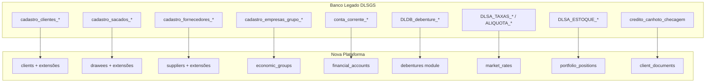
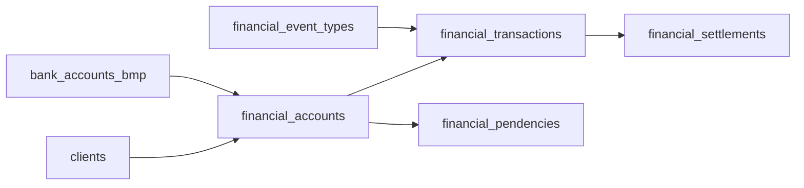
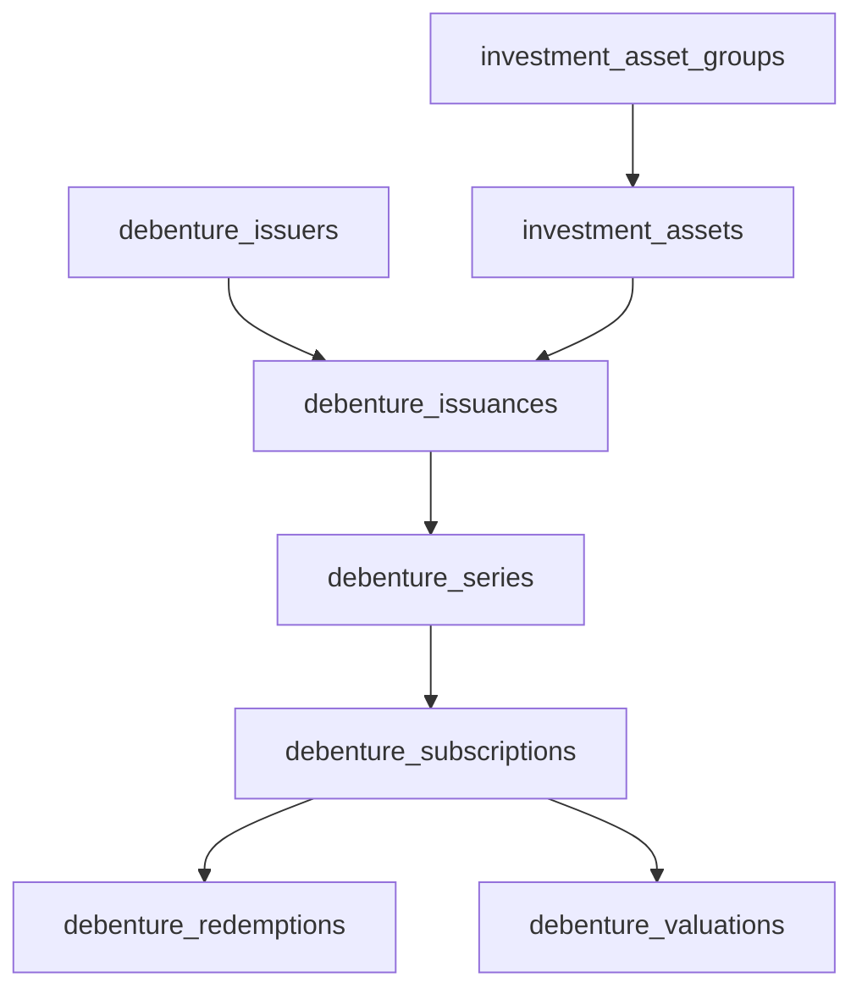

# Mapeamento Arquitetural — Legado → Nova Plataforma

Análise de como os domínios do banco legado (DLSGS) se encaixam na arquitetura de dados da nova plataforma, com propostas de design seguindo os padrões já estabelecidos no projeto.

## Princípios aplicados

- **DDD Leve:** cada domínio tem suas próprias tabelas — sem FK polimórficas implícitas
- **UUID como PK:** todas as tabelas novas usam `uuid` com `defaultRandom()`
- **IDs de rastreabilidade legados:** campos opcionais `legacy_sgs_id integer` e `legacy_nf_id integer` em toda tabela migrada
- **Padrão de nomenclatura:** `snake_case` inglês, plural para tabelas
- **Timestamps:** `created_at` / `updated_at` com `withTimezone: true` em toda tabela
- **Soft delete:** `deleted_at timestamp` onde necessário, em vez de exclusão física

---

## Visão geral do mapeamento



---

## Padrão: Documentos e Storage

Toda entidade que possui documentos (clients, drawees, suppliers) segue o mesmo padrão:

1. **Tabela `*_documents`** com `storage_path text NOT NULL` — todo documento uploadado obrigatoriamente aponta para um arquivo no Supabase Storage. Campos-chave: `id`, `storage_path`, `file_name`, `mime_type`, `file_size`, `document_type`, `validation_status`, `validated_at`, `extracted_data`, `uploaded_by`.

2. **Ponteiros de identidade na entidade principal** (apenas para documentos de identificação "ativos"): `rg_document_id uuid FK → *_documents(id)` e `cnh_document_id uuid FK → *_documents(id)`. São conveniência — o arquivo e seus metadados vivem em `*_documents`; a entidade principal só guarda quem é o documento corrente. Aplicável a entidades PF ou que aceitam ambos os tipos de pessoa.

3. **Sem `file_path` ou `storage_path` direto nas tabelas de entidade** — o caminho do arquivo nunca fica em `clients`, `drawees` ou `suppliers`; sempre em `*_documents` via FK.

---

## A. Módulo `clients` — Enriquecimento

### Situação atual

O schema [`apps/api/src/database/schema/clients.ts`](../../../apps/api/src/database/schema/clients.ts) cobre apenas PJ com dados simplificados. Falta:
- Suporte a PF (cedente pessoa física)
- Dados de documentos (RG, CNH)
- Ciclo de vida do cadastro (datas de aprovação, renovação, encerramento)
- Flags de compliance (PEP, OFAC)
- Vínculo com grupo econômico

### Campos a adicionar em `clients`

```
-- Tipo de pessoa
person_type          text NOT NULL DEFAULT 'company'  -- 'individual' | 'company'
cnpj_root            text                             -- 8 dígitos (agrupamento de filiais)

-- Documentos de identificação (PF)
-- CPF é obrigatório para PF e também aparece na CNH desde 1997 como identificador primário
cpf                  text                             -- 11 dígitos, sem formatação
rg                   text                             -- número do RG
rg_issuer            text                             -- órgão emissor (ex: SSP/SP)
rg_issued_at         date
cnh_number           text                             -- número de registro da CNH (distinto do CPF)
cnh_issued_at        date
cnh_expires_at       date
passport_number      text
foreign_id           text                             -- RNE ou equivalente

-- Referências aos arquivos no storage (FK → client_documents)
-- Evita duplicar caminhos de arquivo na tabela; o documento completo (arquivo, validade, status) vive em client_documents
rg_document_id       uuid REFERENCES client_documents(id)   -- documento RG ativo vinculado
cnh_document_id      uuid REFERENCES client_documents(id)   -- CNH ativa vinculada

-- Dados PF complementares
birth_date           date
gender               text                             -- 'M' | 'F' | 'other'
nationality          text
marital_status       text
naturality           text
mother_name          text
father_name          text

-- Dados PJ complementares
state_registration   text                             -- inscrição estadual
city_registration    text                             -- inscrição municipal
founded_at           date
established_at       date                             -- data de constituição formal

-- Ciclo cadastral
registration_status  text NOT NULL DEFAULT 'prospect'
prospect_at          timestamp with time zone
approved_at          timestamp with time zone
renewed_at           timestamp with time zone
closed_at            timestamp with time zone
closure_reason       text

-- Compliance KYC/AML
is_pep               boolean NOT NULL DEFAULT false
is_pep_related       boolean NOT NULL DEFAULT false
is_ofac_listed       boolean NOT NULL DEFAULT false
has_risk_profession  boolean NOT NULL DEFAULT false
has_risk_activity    boolean NOT NULL DEFAULT false
has_risk_city        boolean NOT NULL DEFAULT false
risk_rating          text                             -- 'AA' | 'A' | 'B' | 'C' | 'D' | 'E'
revenue_situation    text                             -- situação cadastral Receita Federal

-- Relacionamentos
economic_group_id    uuid REFERENCES economic_groups(id)

-- Rastreabilidade legado
legacy_sgs_id        integer
legacy_nf_id         integer
```

### Novas tabelas do módulo `clients`

**`client_contacts`** — em `apps/api/src/database/schema/client-contacts.ts`
```
id                   uuid PK
client_id            uuid FK → clients(id)
contact_name         text
use_type             text        -- 'commercial' | 'financial' | 'operational' | 'billing'
email                text
email_secondary      text
phone                text
phone_mobile         text
phone_sms            text
whatsapp             boolean DEFAULT false
homepage             text
notes                text
is_primary           boolean DEFAULT false
is_active            boolean DEFAULT true
created_at           timestamp
updated_at           timestamp
```

**`client_addresses`** — em `apps/api/src/database/schema/client-addresses.ts`
```
id                   uuid PK
client_id            uuid FK → clients(id)
use_type             text        -- 'commercial' | 'fiscal' | 'correspondence' | 'billing'
street               text
number               text
without_number       boolean DEFAULT false
complement           text
neighborhood         text
zip_code             text
city                 text
state                char(2)
is_primary           boolean DEFAULT false
is_active            boolean DEFAULT true
created_at           timestamp
updated_at           timestamp
```

**`client_bank_accounts`** — em `apps/api/src/database/schema/client-bank-accounts.ts`
```
id                   uuid PK
client_id            uuid FK → clients(id)
bank_code            text        -- código BACEN
bank_name            text
branch               text
account_number       text        -- conta com dígito
account_type         text        -- 'checking' | 'savings' | 'payment'
pix_key              text
nickname             text
opened_at            date
closed_at            date
status               text        -- 'active' | 'closed' | 'blocked'
is_primary           boolean DEFAULT false
created_at           timestamp
updated_at           timestamp
```

**`client_authorized_persons`** — em `apps/api/src/database/schema/client-authorized-persons.ts`
```
id                   uuid PK
client_id            uuid FK → clients(id)
authorization_type   text        -- 'partner' | 'attorney' | 'legal_representative' | 'authorized'
full_name            text NOT NULL
cpf                  text
phone                text
email                text
is_active            boolean DEFAULT true
created_at           timestamp
updated_at           timestamp
```

---

## B. Nova Entidade: `drawees` (Sacados)

Entidade própria com estrutura análoga a `clients`. Localização: `apps/api/src/database/schema/drawees.ts`.

```
id                   uuid PK
person_type          text NOT NULL DEFAULT 'company'
cpf                  text
cnpj                 text NOT NULL UNIQUE (quando PJ)
cnpj_root            text
trade_name           text
company_name         text NOT NULL
legal_name           text

-- Dados PF (quando PF)
rg                   text
birth_date           date
gender               text

-- Compliance
is_pep               boolean DEFAULT false
is_ofac_listed       boolean DEFAULT false
risk_rating          text
credit_score         integer

-- Gestão
assigned_to          uuid FK → profiles(id)
segment_id           uuid FK → segments(id)

-- Status
status               text DEFAULT 'active'
blocked_at           timestamp
block_reason         text

-- Rastreabilidade legado
legacy_sgs_id        integer
legacy_nf_id         integer

created_at           timestamp
updated_at           timestamp
```

**Sub-tabelas de sacado** (mesmo padrão de clients):
- `drawee_contacts` — contatos + campos extras: `billing_email`, `xml_email`, `billing_phone`
- `drawee_addresses` — endereços + tipo `billing` com campos duplicados de cobrança
- `drawee_bank_accounts` — contas bancárias
- `drawee_groups` — grupos econômicos de sacados (FK → `drawee_economic_groups`)
- `drawee_enabled_products` — produtos habilitados (FK → `credit_products`)
- `drawee_documents` — documentos do sacado com `storage_path NOT NULL` (mesmo padrão de `client_documents`)

**Ponteiros de identidade** (para sacados PF — mesmo padrão de `clients`):
```
rg_document_id       uuid REFERENCES drawee_documents(id)   -- RG ativo vinculado
cnh_document_id      uuid REFERENCES drawee_documents(id)   -- CNH ativa vinculada
```

---

## C. Nova Entidade: `suppliers` (Fornecedores)

Entidade mais simples. Localização: `apps/api/src/database/schema/suppliers.ts`.

```
id                   uuid PK
person_type          text NOT NULL DEFAULT 'company'
cpf                  text
cnpj                 text
trade_name           text
company_name         text NOT NULL
service_category     text        -- categoria de serviço prestado

-- Ciclo
onboarded_at         date
offboarded_at        date
offboarding_reason   text
status               text DEFAULT 'active'

-- Rastreabilidade legado
legacy_sgs_id        integer
legacy_nf_id         integer

created_at           timestamp
updated_at           timestamp
```

Sub-tabelas: `supplier_contacts`, `supplier_addresses`, `supplier_bank_accounts`, `supplier_documents`.

`supplier_documents` segue o mesmo padrão de `client_documents` com `storage_path NOT NULL`.

---

## D. Nova Entidade: `economic_groups`

Agrupa entidades (clientes, sacados, fornecedores, empresas do grupo) em conglomerados para análise consolidada de risco e exposição.

**`economic_groups`** — em `apps/api/src/database/schema/economic-groups.ts`
```
id                   uuid PK
name                 text NOT NULL
type                 text        -- 'client_group' | 'drawee_group' | 'sarfaty_group'
active_since         date
inactive_since       date
status               text DEFAULT 'active'
legacy_sgs_id        integer
legacy_nf_id         integer
created_at           timestamp
updated_at           timestamp
```

**`economic_group_members`** — relacionamento polimórfico explícito
```
id                   uuid PK
economic_group_id    uuid FK → economic_groups(id)
member_type          text NOT NULL   -- 'client' | 'drawee' | 'supplier' | 'company'
client_id            uuid FK → clients(id) NULLABLE
drawee_id            uuid FK → drawees(id) NULLABLE
supplier_id          uuid FK → suppliers(id) NULLABLE
joined_at            date
left_at              date
is_headquarters      boolean DEFAULT false
created_at           timestamp
```

**`economic_group_persons`** — pessoas físicas relacionadas ao grupo
```
id                   uuid PK
economic_group_id    uuid FK → economic_groups(id)
relationship_type    text        -- 'partner' | 'administrator' | 'attorney' | 'representative'
full_name            text NOT NULL
cpf_cnpj             text
is_active            boolean DEFAULT true
created_at           timestamp
```

**`economic_group_bank_accounts`** — contas bancárias do grupo
```
-- mesmo padrão de client_bank_accounts com FK para economic_groups
```

---

## E. Novo Módulo: `financial-accounts` (Conta Corrente)

Representa a conta gráfica interna de cada cedente na Sarfaty. Localização: `apps/api/src/database/schema/financial-*.ts`.

### Diagrama



**`financial_accounts`**
```
id                   uuid PK
client_id            uuid FK → clients(id)
account_type         text        -- 'graphic' | 'real'
bank_code            text
branch               text
account_number       text
status               text        -- 'active' | 'closed' | 'blocked'
block_type           text
block_reason         text
fees                 numeric(18,4)
opened_at            date
closed_at            date
legacy_nf_id         integer
legacy_sgs_id        integer
created_at           timestamp
updated_at           timestamp
```

**`financial_event_types`** — tabela de domínio (de-para de eventos)
```
id                   uuid PK
legacy_nf_code       integer
legacy_sgs_code      integer
name                 text NOT NULL
entry_type           char(1) NOT NULL   -- 'D' | 'C'
description          text
is_active            boolean DEFAULT true
created_at           timestamp
```

**`financial_transactions`**
```
id                   uuid PK
financial_account_id uuid FK → financial_accounts(id)
event_type_id        uuid FK → financial_event_types(id)
amount               numeric(18,4) NOT NULL
entry_type           char(1) NOT NULL   -- 'D' | 'C'
description          text
transaction_date     date NOT NULL
reference_nf_code    integer
reference_sgs_code   integer
created_at           timestamp
```

**`financial_pendencies`**
```
id                   uuid PK
financial_account_id uuid FK → financial_accounts(id)
event_type_id        uuid FK → financial_event_types(id)
drawee_id            uuid FK → drawees(id)
original_amount      numeric(18,4) NOT NULL
corrected_amount     numeric(18,4)
settled_amount       numeric(18,4)
pending_date         date NOT NULL
settlement_date      date
is_reversal          boolean DEFAULT false
notes                text
legacy_nf_code       integer
legacy_sgs_code      integer
created_at           timestamp
updated_at           timestamp
```

---

## F. Novo Módulo: `debentures`

Módulo completo para gestão de debêntures emitidas e debenturistas.



**`debenture_issuers`** — emissores (empresas do grupo Sarfaty)
```
id                   uuid PK
cnpj                 text NOT NULL UNIQUE
legal_name           text NOT NULL
address_*            text         -- campos de endereço
bank_code            text
bank_branch          text
bank_account         text
status               text DEFAULT 'active'
legacy_sgs_id        integer
created_at / updated_at
```

**`debenture_issuances`** — emissões
```
id                   uuid PK
issuer_id            uuid FK → debenture_issuers(id)
asset_id             uuid FK → investment_assets(id)
issuance_number      integer NOT NULL
name                 text NOT NULL
yield_type           text NOT NULL   -- 'CDI' | 'IPCA' | 'fixed' | 'other'
issuance_type        text DEFAULT 'private'
species              text DEFAULT 'subordinated'
issuance_form        text
issuance_date        date NOT NULL
maturity_date        date NOT NULL
integration_deadline date
series_count         integer
total_quantity       integer NOT NULL
total_value          numeric(15,2) NOT NULL
unit_price           numeric(15,2) NOT NULL
penalty_rate         numeric(5,2)
mora_rate            numeric(5,2)
balance              numeric(15,2)
status               text DEFAULT 'open'
prospectus_file_path text         -- Supabase Storage path
age_document_path    text         -- Supabase Storage path
legacy_sgs_id        integer
legacy_nf_id         integer
created_at / updated_at
```

**`debenture_series`** — séries por emissão
```
id                   uuid PK
issuance_id          uuid FK → debenture_issuances(id)
series_number        integer NOT NULL
index_type           text NOT NULL   -- 'CDI' | 'IPCA' | 'fixed'
index_percentage     numeric(15,4)   -- % do índice (ex: 120 para 120% CDI)
issuance_rate        numeric(15,4)
std_deviation        numeric(15,4)
quantity             integer NOT NULL
balance_quantity     integer NOT NULL
maturity_date        date NOT NULL
target_audience      text   -- 'general' | 'qualified' | 'professional'
allow_web_redemption boolean DEFAULT false
publish_on_portal    boolean DEFAULT false
status               text DEFAULT 'open'
legacy_sgs_id        integer
legacy_nf_id         integer
created_at / updated_at
```

**`debenture_subscriptions`** — subscrições por debenturista
```
id                   uuid PK
series_id            uuid FK → debenture_series(id)
debenturist_id       uuid FK → clients(id)  -- debenturista é cliente
subscription_date    date NOT NULL
unit_price_at_sub    numeric(16,7) NOT NULL
quantity             integer NOT NULL
total_value          numeric(15,2) NOT NULL
redeemed_quantity    integer DEFAULT 0
balance_quantity     integer NOT NULL
status               text DEFAULT 'active'
legacy_sgs_id        integer
legacy_nf_id         integer
created_at / updated_at
```

**`debenture_redemptions`** — resgates
```
id                   uuid PK
subscription_id      uuid FK → debenture_subscriptions(id)
requested_at         timestamp NOT NULL
processed_at         timestamp
settled_at           timestamp
quantity             integer NOT NULL
unit_price_at_sub    numeric(15,2)
unit_price_at_red    numeric(15,2)
invested_value       numeric(15,2)
gross_redemption     numeric(15,2)
gross_yield          numeric(15,2)
ir_withheld          numeric(15,2)
iof_withheld         numeric(15,2)
net_redemption       numeric(15,2)
net_yield            numeric(15,2)
ir_rate              numeric(5,2)
iof_rate             numeric(5,2)
elapsed_days         integer
iof_days             integer
yield_rate           numeric(7,4)
status               integer DEFAULT 0   -- 0=pending | 1=processed | 2=settled
legacy_sgs_id        integer
legacy_nf_id         integer
created_at / updated_at
```

**`debenture_valuations`** — valorização diária (série temporal)
```
id                   uuid PK
subscription_id      uuid FK → debenture_subscriptions(id)
valuation_date       date NOT NULL
subscription_date    date NOT NULL
index_type           text
issuance_rate        numeric(15,4)
capitalized_rate     numeric(15,4)
index_daily_factor   numeric(18,16)
prev_day_gross_value numeric(15,2)
daily_yield          numeric(15,4)
monthly_yield        numeric(15,4)
prev_month_yield     numeric(15,4)
cumulative_yield     numeric(15,4)
issuance_unit_price  numeric(15,2)
current_quantity     integer
current_unit_price   numeric(15,2)
current_value        numeric(15,2)
gross_value          numeric(15,2)
daily_gross_yield    numeric(15,2)
cumulative_gross_yield numeric(15,2)
elapsed_days         integer
iof_free_days        integer
iof_rate             numeric(5,2)
calculated_iof       numeric(15,2)
ir_rate              numeric(5,2)
calculated_ir        numeric(15,2)
net_yield            numeric(15,2)
net_value            numeric(15,2)
created_at           timestamp
```

**`investment_asset_groups`** e **`investment_assets`** — catálogo de ativos
```
-- investment_asset_groups
id, name, subscription_cutoff_time, redemption_cutoff_time,
redemption_settlement_days, reservation_settlement_days,
redemption_cancel_days, min_redemption_quantity,
has_iof, has_ir, legacy_sgs_id, created_at/updated_at

-- investment_assets
id, asset_group_id, asset_type, yield_type, name,
+ mesmos campos de horários/prazos (override do grupo)
legacy_sgs_id, created_at/updated_at
```

---

## G. Novo Módulo: `market-rates`

Taxas e índices financeiros. Schema único com discriminador de tipo.

**`market_rates`** — série histórica unificada
```
id                   uuid PK
rate_type            text NOT NULL   -- 'DI' | 'SELIC' | 'other'
rate_date            date NOT NULL
value                numeric(18,6) NOT NULL
source               text DEFAULT 'B3'
created_at           timestamp

UNIQUE (rate_type, rate_date)
```

**`iof_rates`** — tabela regressiva IOF (dados estáticos)
```
id                   uuid PK
elapsed_days         integer NOT NULL UNIQUE  -- 0 a 30
rate_percentage      numeric(5,4) NOT NULL
created_at           timestamp
```

**`ir_rates`** — tabela regressiva IR (dados estáticos)
```
id                   uuid PK
min_days             integer NOT NULL
max_days             integer            -- NULL = sem limite superior
rate_percentage      numeric(5,2) NOT NULL
created_at           timestamp
```

---

## H. Novo Módulo: `portfolio`

Posição de carteira dos FIDCs — tabela de série temporal por fundo.

**`portfolio_positions`**
```
id                   uuid PK
fund_name            text NOT NULL      -- 'hemera' | 'singulare' | outro
fund_cnpj            text
position_date        date NOT NULL
client_id            uuid FK → clients(id) NULLABLE   -- quando cedente conhecido
drawee_id            uuid FK → drawees(id) NULLABLE   -- quando sacado conhecido
cedent_doc           text               -- fallback quando entidade não migrada
drawee_doc           text               -- fallback quando entidade não migrada
cedent_name          text
drawee_name          text
asset_type           text               -- 'duplicate' | 'ccb' | 'nfe' | 'check'
asset_subtype        text
document_number      text
title_id_external    text               -- ID no sistema externo (Vadu/Vx)
emission_date        date
acquisition_date     date
original_maturity    date
adjusted_maturity    date
extension_date       date
nominal_value        numeric(18,4) NOT NULL
acquisition_value    numeric(18,4)
current_nominal      numeric(18,4)
present_value        numeric(18,4)
mtm_value            numeric(18,4)
pdd_note             text               -- 'AA' | 'A' | 'B' | 'C' | 'D' | 'E'
pdd_rating_value     numeric(18,4)
pdd_overdue_value    numeric(18,4)
status               text               -- 'current' | 'overdue' | 'settled' | 'default'
has_coobligation     boolean DEFAULT false
originador_doc       text
cnae                 text
source_file          text
created_at           timestamp

INDEX ON (fund_name, position_date)
INDEX ON (drawee_doc, position_date)
INDEX ON (cedent_doc, position_date)
```

---

## I. Extensão de `client_documents` (Checagem)

A tabela `credito_canhoto_checagem` é reconstituída pelo enriquecimento de `client_documents`:

**Campos a adicionar em `client_documents`**:
```
-- Checagem de canhoto
canhoto_reference       text        -- código do canhoto
canhoto_date            date        -- data do canhoto
canhoto_status          text        -- 'received' | 'pending' | 'lost'
collection_order        text        -- ordem de coleta física
collection_status       text        -- 'scheduled' | 'done' | 'cancelled'
verification_date       date
verification_status     text        -- 'pending' | 'approved' | 'rejected'
verification_notes      text
confirmation_type       text        -- 'physical' | 'digital' | 'implicit'
confirmation_status     text        -- 'pending' | 'confirmed' | 'rejected'
nfe_number              text        -- NF-e vinculada
nfe_value               numeric(18,4)
```

---

## Resumo: tabelas por módulo e localização

| Módulo | Tabelas novas | Localização |
|--------|---------------|-------------|
| clients (extensão) | `client_contacts`, `client_addresses`, `client_bank_accounts`, `client_authorized_persons` | `apps/api/src/database/schema/` |
| drawees | `drawees`, `drawee_contacts`, `drawee_addresses`, `drawee_bank_accounts`, `drawee_documents`, `drawee_groups`, `drawee_enabled_products` | `apps/api/src/database/schema/` + `apps/api/src/modules/drawees/` |
| suppliers | `suppliers`, `supplier_contacts`, `supplier_addresses`, `supplier_bank_accounts`, `supplier_documents` | `apps/api/src/database/schema/` + `apps/api/src/modules/suppliers/` |
| economic-groups | `economic_groups`, `economic_group_members`, `economic_group_persons`, `economic_group_bank_accounts` | `apps/api/src/database/schema/` + `apps/api/src/modules/economic-groups/` |
| financial-accounts | `financial_accounts`, `financial_event_types`, `financial_transactions`, `financial_pendencies`, `financial_settlements` | `apps/api/src/database/schema/` + `apps/api/src/modules/financial-accounts/` |
| debentures | `debenture_issuers`, `debenture_issuances`, `debenture_series`, `debenture_subscriptions`, `debenture_redemptions`, `debenture_valuations`, `investment_asset_groups`, `investment_assets` | `apps/api/src/database/schema/` + `apps/api/src/modules/debentures/` |
| market-rates | `market_rates`, `iof_rates`, `ir_rates` | `apps/api/src/database/schema/` |
| portfolio | `portfolio_positions` | `apps/api/src/database/schema/` |
| clients (extensão) | campos adicionais em `client_documents` | `apps/api/src/database/schema/client-documents.ts` |

---

## Priorização sugerida

```
Sprint A — Enriquecimento de entidades existentes [IMPLEMENTADO]
  1. ✓ Adicionar campos PF/compliance/legado em clients (cnpj nullable + ~35 colunas)
  2. ✓ Criar client_contacts, client_addresses, client_bank_accounts, client_authorized_persons
  3. ✓ Criar economic_groups + economic_group_members + economic_group_persons + economic_group_bank_accounts
  migration: enrich_clients_and_economic_groups

Sprint B — Novos domínios de cadastro [IMPLEMENTADO]
  4. ✓ Criar drawees + drawee_documents + sub-tabelas (contacts, addresses, bank_accounts)
  5. ✓ Criar suppliers + supplier_documents + sub-tabelas (contacts, addresses, bank_accounts)
  6. ✓ Criar drawee_groups, drawee_enabled_products
  migration: create_drawees_and_suppliers

Sprint C — Módulo financeiro [IMPLEMENTADO]
  7. ✓ Criar financial_event_types, financial_accounts
  8. ✓ Criar financial_transactions, financial_pendencies, financial_settlements
  migration: create_financial_accounts_module

Sprint D — Investimentos [IMPLEMENTADO]
  9. ✓ Criar investment_asset_groups, investment_assets
  10. ✓ Criar debenture_issuers, debenture_issuances, debenture_series
  11. ✓ Criar debenture_subscriptions, debenture_redemptions, debenture_valuations
  migration: create_debentures_module

Sprint E — Carteira FIDC + Market Rates [IMPLEMENTADO]
  12. ✓ Criar market_rates, iof_rates, ir_rates
  13. ✓ Criar portfolio_positions
  migration: create_market_rates_and_portfolio

Sprint I — Checagem de Canhoto [IMPLEMENTADO]
  14. ✓ Estender client_documents com campos de canhoto/verificação
  migration: extend_client_documents_canhoto
```

---

## Campos que NÃO serão migrados

Os seguintes campos/tabelas do legado não têm equivalente na nova plataforma e devem ser descartados ou mantidos apenas em arquivo histórico:

| Legado | Motivo do descarte |
|--------|-------------------|
| `DLSA_TAXAS_DI_BKP` / `DLSA_TAXAS_SELIC_BKP` | Backups redundantes — substituídos por backup nativo PostgreSQL |
| `status_cadastro varchar(10)` como campo legado | Substituído por enums e timestamps |
| Campos `*_bkp` em e-mails e telefones | Artefatos de integração legada sem propósito no novo sistema |
| `data_carga datetime2` | Substituído por `created_at` padrão |
| `empCodigo int` | Contexto multi-empresa do legado — nova plataforma é single-tenant por design |
| Tabelas `DLDB_cadastro_*` | Redundância com `cadastro_clientes_*` — dados já mapeados |
