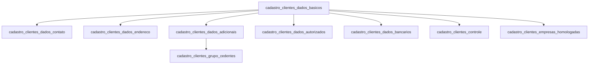

# Clientes (Cedentes) — Banco Legado

Domínio de cadastro dos **cedentes**: empresas e pessoas físicas que cedem seus títulos (duplicatas, cheques, notas fiscais) para a Sarfaty no contexto de factoring e FIDC.

No legado, o termo "cliente" e "cedente" são usados de forma intercambiável. No novo sistema, o equivalente é a entidade `clients`.

## Relações entre tabelas

O relacionamento é via `id_net_factor` (FK implícita para o `nfCedente` do NetFactor) e `id_sgs` (FK para o sistema SGS).

---

## `cadastro_clientes_dados_basicos`

**Propósito:** Identidade principal do cedente — dados de PF ou PJ, documentos, status cadastral. É a tabela raiz do domínio.

| Coluna | Tipo | Nulável | Descrição |
|--------|------|---------|-----------|
| `id_clientes_dados_basicos` | `int` | PK | Identificador legado. Substituir por UUID na migração. |
| `id_sgs` | `int` | sim | ID no sistema SGS — chave de rastreabilidade. |
| `id_net_factor` | `int` | sim | ID no NetFactor (`nfCedente.cedCodigo`) — chave de rastreabilidade. |
| `cpf` | `varchar(11)` | sim | CPF para pessoa física (apenas dígitos). Mutuamente exclusivo com `cnpj`. |
| `cnpj` | `varchar(14)` | sim | CNPJ para pessoa jurídica (apenas dígitos). Mutuamente exclusivo com `cpf`. |
| `cnpj_raiz` | `varchar(8)` | sim | Primeiros 8 dígitos do CNPJ — usado para agrupar filiais de um mesmo grupo. |
| `ligada_grupo_sarfaty` | `varchar(40)` | sim | Indica se a empresa pertence ao grupo econômico Sarfaty. |
| `tipo_pf_pj` | `varchar(2)` | sim | Tipo da pessoa: `'PF'` (física) ou `'PJ'` (jurídica). |
| `nome` | `varchar(200)` | sim | Nome completo (PF) ou razão social abreviada (PJ). |
| `nome_social` | `varchar(200)` | sim | Nome social (PF transgênera ou preferência declarada). |
| `nome_preferido` | `varchar(200)` | sim | Como o cliente prefere ser chamado (apelido comercial). |
| `razao_social` | `varchar(200)` | sim | Razão social completa (somente PJ). |
| `nome_fantasia` | `varchar(200)` | sim | Nome fantasia/comercial (somente PJ). |
| `inscr_estadual` | `varchar(20)` | sim | Inscrição estadual (PJ). |
| `inscr_municipal` | `varchar(20)` | sim | Inscrição municipal (PJ). |
| `tipo_documento` | `varchar(40)` | sim | Tipo do documento de identidade alternativo (ex: Passaporte, RNE). |
| `documento` | `varbinary` | sim | Binário do documento digitalizado. Migrar para Supabase Storage. |
| `rg` | `varchar(20)` | sim | RG (PF). |
| `rg_orgao_emissor` | `varchar(20)` | sim | Órgão emissor do RG (ex: SSP-SP). |
| `rg_data_emissao` | `date` | sim | Data de emissão do RG. |
| `cnh` | `varchar(20)` | sim | Número da CNH (PF). |
| `cnh_data_emissao` | `date` | sim | Data de emissão da CNH. |
| `passaporte` | `varchar(20)` | sim | Número do passaporte (estrangeiros). |
| `identidade_estrangeira` | `varchar(30)` | sim | RNE ou documento de identidade estrangeiro. |
| `profissao` | `varchar(100)` | sim | Profissão declarada (PF). |
| `nacionalidade` | `varchar(100)` | sim | Nacionalidade (PF). |
| `data_nascimento` | `date` | sim | Data de nascimento (PF). |
| `sexo` | `char(1)` | sim | Sexo biológico: `'M'` ou `'F'` (PF). |
| `naturalidade` | `varchar(100)` | sim | Cidade/estado de nascimento (PF). |
| `nome_mae` | `varchar(100)` | sim | Nome da mãe (PF) — usado em consultas a bureaus de crédito. |
| `nome_pai` | `varchar(100)` | sim | Nome do pai (PF). |
| `data_fundacao` | `date` | sim | Data de fundação da empresa (PJ). |
| `data_constituicao` | `date` | sim | Data de constituição formal/registro (PJ). |
| `declaracao_pep` | `bit` | sim | Declara ser Pessoa Politicamente Exposta (PEP). |
| `declaracao_pep_relacionado` | `bit` | sim | Declara ser relacionado a um PEP. |
| `status_cadastro` | `varchar(10)` | sim | Status: `ATIVO`, `INATIVO`, `EXCLUIDO`. |
| `data_carga` | `datetime2` | sim | Data de carga no Data Lake. Default: `sysutcdatetime()`. |

---

## `cadastro_clientes_dados_contato`

**Propósito:** Contatos múltiplos por cedente. Um cedente pode ter vários registros nessa tabela com diferentes tipos de uso.

| Coluna | Tipo | Nulável | Descrição |
|--------|------|---------|-----------|
| `id_clientes_dados_contato` | `int` | PK | Identificador legado. |
| `id_net_factor` | `int` | sim | FK para `cadastro_clientes_dados_basicos.id_net_factor`. |
| `nome_contato` | `varchar(200)` | sim | Nome da pessoa de contato (ex: responsável financeiro). |
| `detalhes_contato` | `varchar(500)` | sim | Observações livres sobre o contato. |
| `homepage` | `varchar(200)` | sim | URL do site da empresa. |
| `email` | `varchar(1000)` | sim | E-mail principal do contato. |
| `email_multiplo` | `varchar(1000)` | sim | Múltiplos e-mails separados por ponto-e-vírgula — manter como campo único legado. |
| `email_bkp` | `varchar(1000)` | sim | E-mail de backup (campo legado). |
| `email_principal` | `bit` | sim | Indica se este é o contato principal do cedente. |
| `telefone` | `varchar(300)` | sim | Telefone fixo. |
| `telefone_cel` | `varchar(300)` | sim | Telefone celular. |
| `telefone_sms` | `varchar(300)` | sim | Número para envio de SMS. |
| `telefone_fax` | `varchar(300)` | sim | Fax. |
| `telefone_principal` | `bit` | sim | Indica se este telefone é o principal. |
| `fax` | `bit` | sim | Flag legada indicando se tem fax. |
| `whatsapp` | `bit` | sim | Indica se o celular recebe WhatsApp. |
| `status` | `bit` | sim | Contato ativo (`1`) ou inativo (`0`). |
| `uso` | `varchar(100)` | sim | Tipo de uso do contato (ex: `Comercial`, `Financeiro`, `Operacional`). |
| `status_cadastro` | `varchar(10)` | sim | Status: `ATIVO`, `INATIVO`, `EXCLUIDO`. |
| `data_carga` | `datetime2` | sim | Data de carga no Data Lake. |

---

## `cadastro_clientes_dados_endereco`

**Propósito:** Endereços múltiplos por cedente. Um cedente pode ter endereço comercial, fiscal, de cobrança e outros.

| Coluna | Tipo | Nulável | Descrição |
|--------|------|---------|-----------|
| `id_clientes_dados_endereco` | `int` | PK | Identificador legado. |
| `id_net_factor` | `int` | sim | FK para o cedente no NetFactor. |
| `id_sgs` | `int` | sim | FK para o cedente no SGS. |
| `logradouro` | `varchar(250)` | sim | Rua/avenida/praça. |
| `sem_numero` | `bit` | sim | Flag: endereço sem número (área rural, etc.). |
| `numero` | `varchar(20)` | sim | Número do imóvel. |
| `complemento` | `varchar(100)` | sim | Bloco, apartamento, sala, andar. |
| `cep` | `varchar(8)` | sim | CEP (apenas dígitos, 8 caracteres). |
| `bairro` | `varchar(100)` | sim | Bairro. |
| `cidade` | `varchar(200)` | sim | Cidade. |
| `estado` | `char(2)` | sim | UF (sigla, ex: `SP`, `RJ`). |
| `endereco_principal` | `bit` | sim | Indica se é o endereço principal do cedente. |
| `status` | `bit` | sim | Endereço ativo (`1`) ou inativo (`0`). |
| `uso` | `varchar(100)` | sim | Tipo de uso: `Comercial`, `Fiscal`, `Correspondência`, `Cobrança`. |
| `status_cadastro` | `varchar(10)` | sim | Status: `ATIVO`, `INATIVO`, `EXCLUIDO`. |
| `data_carga` | `datetime2` | sim | Data de carga no Data Lake. |

---

## `cadastro_clientes_dados_adicionais`

**Propósito:** Dados complementares de compliance, relacionamento comercial e ciclo de vida do cadastro. Contém informações críticas para KYC/AML e gestão do relacionamento.

| Coluna | Tipo | Nulável | Descrição |
|--------|------|---------|-----------|
| `id_clientes_dados_adicionais` | `int` | PK | Identificador legado. |
| `origem_dado` | `varchar(20)` | sim | Sistema de origem do dado: `NetFactor`, `SGS`, `BMP`. |
| `outras_tabelas` | `varchar(200)` | sim | Referência a outras tabelas relacionadas (campo legado de integração). |
| `id_sgs` | `int` | sim | FK para o cedente no SGS. |
| `id_net_factor` | `int` | sim | FK para o cedente no NetFactor. |
| `cpf_gerente_responsavel` | `varchar(11)` | sim | CPF do gerente de relacionamento responsável pelo cedente. |
| `nome_gerente_responsavel` | `varchar(200)` | sim | Nome do gerente responsável. |
| `email_gerente_responsavel` | `varchar(200)` | sim | E-mail do gerente responsável. |
| `telefone_gerente_responsavel` | `varchar(20)` | sim | Telefone do gerente responsável. |
| `id_gerente_responsavel` | `int` | sim | ID interno do gerente no sistema. |
| `data_inclusao_prospect` | `date` | sim | Data em que o cedente entrou como prospect (início do pipeline comercial). |
| `data_aprovacao_cadastro` | `date` | sim | Data de aprovação formal do cadastro (KYC completo). |
| `data_renovacao_cadastral` | `date` | sim | Data da última renovação cadastral (compliance periódico). |
| `data_encerramento_cadastro` | `date` | sim | Data de encerramento do relacionamento. |
| `motivo_encerramento` | `varchar(100)` | sim | Motivo do encerramento (ex: inadimplência, solicitação do cliente). |
| `status_cadastro_sistema` | `varchar(40)` | sim | Status detalhado no sistema operacional (ex: `Ativo`, `Bloqueado`, `Em análise`). |
| `tipo_bloqueio` | `varchar(40)` | sim | Tipo de bloqueio aplicado (ex: `Compliance`, `Inadimplência`, `Judicial`). |
| `pep_monitoramento` | `bit` | sim | PEP em monitoramento ativo. |
| `pep_relacionado_monitoramento` | `bit` | sim | Relacionado a PEP em monitoramento ativo. |
| `pep_conciliacao` | `bit` | sim | PEP em processo de conciliação. |
| `pep_relacionado_conciliacao` | `bit` | sim | Relacionado a PEP em conciliação. |
| `profissao_risco` | `bit` | sim | Profissão classificada como de alto risco (compliance COAF). |
| `atividade_risco` | `bit` | sim | Atividade econômica classificada como de risco. |
| `cidade_risco` | `bit` | sim | Cidade classificada como de risco para operações. |
| `nome_economico_cedentes` | `varchar(200)` | sim | Nome do grupo econômico ao qual o cedente pertence. |
| `id_nf_grupo_economico` | `int` | sim | ID do grupo econômico no NetFactor. |
| `id_sgs_grupo_economico` | `int` | sim | ID do grupo econômico no SGS. |
| `lista_ofac` | `bit` | sim | Consta na lista OFAC (Office of Foreign Assets Control) — flag de sanção internacional. |
| `produtos_habilitados` | `varchar(200)` | sim | Lista de produtos financeiros habilitados para este cedente. |
| `colaborador_sarfaty` | `bit` | sim | Este cedente também é colaborador (funcionário) da Sarfaty. |
| `correntista_bmp` | `bit` | sim | Possui conta corrente no banco BMP. |
| `empresa_grupo_sarfaty` | `bit` | sim | É empresa integrante do grupo econômico Sarfaty. |
| `fornecedor_sarfaty` | `bit` | sim | Também é fornecedor da Sarfaty. |
| `sacado_sarfaty` | `bit` | sim | Também é sacado de operações da Sarfaty. |
| `doc` | `varchar(14)` | sim | CPF ou CNPJ consolidado (campo de conveniência legado). |
| `situacao_cadastral_receita` | `varchar(100)` | sim | Situação cadastral na Receita Federal (ex: `ATIVA`, `INAPTA`, `SUSPENSA`). |
| `status_cadastro` | `varchar(10)` | sim | Status: `ATIVO`, `INATIVO`, `EXCLUIDO`. |
| `data_carga` | `datetime2` | sim | Data de carga no Data Lake. |

---

## `cadastro_clientes_dados_autorizados`

**Propósito:** Pessoas autorizadas a operar em nome do cedente — representantes legais, procuradores ou pessoas com poderes específicos.

| Coluna | Tipo | Nulável | Descrição |
|--------|------|---------|-----------|
| `id_clientes_dados_autorizados` | `int` | PK | Identificador legado. |
| `id_net_factor` | `int` | sim | FK para o cedente no NetFactor. |
| `tipo` | `varchar(?)` | sim | Tipo de autorização (ex: `Sócio`, `Procurador`, `Representante Legal`). |
| `nome` | `varchar(?)` | sim | Nome da pessoa autorizada. |
| `cpf` | `varchar(11)` | sim | CPF da pessoa autorizada. |
| `telefone` | `varchar(?)` | sim | Telefone de contato. |
| `email` | `varchar(?)` | sim | E-mail de contato. |
| `status_cadastro` | `varchar(10)` | sim | Status: `ATIVO`, `INATIVO`, `EXCLUIDO`. |
| `data_carga` | `datetime2` | sim | Data de carga no Data Lake. |

---

## `cadastro_clientes_dados_bancarios`

**Propósito:** Contas bancárias do cedente utilizadas para pagamentos e recebimentos de operações.

Estrutura similar à de `cadastro_fornecedores_dados_bancarios` (ver padrão comum):

| Coluna | Tipo | Nulável | Descrição |
|--------|------|---------|-----------|
| `id_*` | `int` | PK | Identificador legado. |
| `id_net_factor` / `id_sgs` | `int` | sim | FKs de rastreabilidade. |
| `cpf` / `cnpj` | `varchar` | sim | Documento do titular da conta. |
| `cod_bacen` | `int` | sim | Código BACEN do banco (ex: `237` = Bradesco, `341` = Itaú). |
| `nome_banco` | `varchar(200)` | sim | Nome do banco. |
| `cod_agencia` | `varchar(20)` | sim | Número da agência. |
| `conta_digito` | `varchar(40)` | sim | Conta com dígito verificador. |
| `chave_pix` | `varchar(200)` | sim | Chave PIX (CPF, CNPJ, e-mail, telefone ou chave aleatória). |
| `apelido_conta` | `varchar(100)` | sim | Apelido para identificação rápida da conta. |
| `data_inclusao` | `date` | sim | Data de cadastro da conta. |
| `data_exclusao` | `date` | sim | Data de encerramento/exclusão da conta. |
| `status_cadastro` | `varchar(10)` | sim | Status: `ATIVO`, `INATIVO`, `EXCLUIDO`. |

---

## `cadastro_clientes_controle`

**Propósito:** Controle de workflow do cadastro — rastreia etapas do processo de homologação e aprovação do cedente.

Campos principais: status de cada etapa do processo, usuário responsável, datas de transição.

---

## `cadastro_clientes_empresas_homologadas`

**Propósito:** Empresas que o cedente declarou como clientes/sacados habituais e que foram homologadas pela Sarfaty para operar em conjunto.

---

## `cadastro_clientes_grupo_cedentes`

**Propósito:** Agrupamento de cedentes em grupos econômicos — permite análise consolidada de exposição de risco por grupo.

| Coluna | Tipo | Nulável | Descrição |
|--------|------|---------|-----------|
| `id_grupo_cedentes` | `int` | PK | Identificador do grupo. |
| `nome_grupo` | `varchar(200)` | sim | Nome do grupo econômico. |
| `id_nf_grupo` | `int` | sim | ID do grupo no NetFactor. |
| `id_sgs_grupo` | `int` | sim | ID do grupo no SGS. |
| `data_inclusao` | `date` | sim | Data de criação do grupo. |
| `data_inativacao` | `date` | sim | Data de inativação do grupo. |

---

## Observações de migração

1. **Deduplicação necessária:** os campos `id_sgs` e `id_net_factor` podem apontar para o mesmo cedente com dados ligeiramente divergentes entre os sistemas de origem. A regra de merge deve priorizar o NetFactor como fonte de verdade.

2. **PF vs PJ:** o campo `tipo_pf_pj` determina quais campos são relevantes. No novo schema, considerar `person_type` como enum: `individual | company`.

3. **Documentos binários:** `documento varbinary` deve ser migrado para o Supabase Storage com referência de path na tabela `client_documents`.

4. **Múltiplos contatos e endereços:** o DLSGS já modela as sub-tabelas como 1:N. O novo design deve manter essa estrutura em tabelas separadas (`client_contacts`, `client_addresses`).

5. **Grupo econômico:** `id_nf_grupo_economico` e `id_sgs_grupo_economico` devem ser mapeados para a nova entidade `economic_groups` com `legacy_nf_id` e `legacy_sgs_id`.
