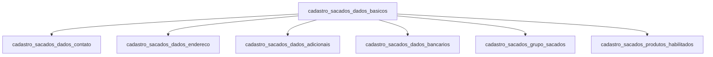

# Sacados — Banco Legado

Domínio de cadastro dos **sacados**: empresas ou pessoas físicas que são os devedores/pagadores dos títulos cedidos. O sacado é quem emitiu a nota fiscal, duplicata ou cheque que o cedente está cedendo à Sarfaty.

No contexto de factoring, o sacado é o "comprador" da relação comercial com o cedente. A qualidade do sacado (histórico de pagamento, limite de crédito) é determinante para a aprovação da operação.

## Relações entre tabelas

---

## `cadastro_sacados_dados_basicos`

**Propósito:** Identidade principal do sacado. Estrutura idêntica à dos clientes com campos adicionais para identificação fiscal e documentos de estrangeiros.

| Coluna | Tipo | Nulável | Descrição |
|--------|------|---------|-----------|
| `id_sacados_dados_basicos` | `int` | PK | Identificador legado. |
| `id_sacado_nf` | `int` | sim | ID no NetFactor (`nfSacado.sacCodigo`). |
| `id_sacado_sgs` | `int` | sim | ID no SGS — chave de rastreabilidade. |
| `cpf` | `varchar(11)` | sim | CPF para sacado pessoa física. |
| `cnpj` | `varchar(14)` | sim | CNPJ para sacado pessoa jurídica. |
| `cnpj_raiz` | `varchar(8)` | sim | Primeiros 8 dígitos do CNPJ — para agrupamento de filiais. |
| `nome` | `varchar(200)` | sim | Nome completo (PF) ou razão social abreviada (PJ). |
| `nome_social` | `varchar(200)` | sim | Nome social. |
| `razao_social` | `varchar(200)` | sim | Razão social completa (PJ). |
| `nome_fantasia` | `varchar(200)` | sim | Nome fantasia (PJ). |
| `inscr_estadual` | `varchar(20)` | sim | Inscrição estadual (PJ). |
| `inscr_municipal` | `varchar(20)` | sim | Inscrição municipal (PJ). |
| `rg` | `varchar(20)` | sim | RG (PF). |
| `rg_orgao_emissor` | `varchar(20)` | sim | Órgão emissor do RG. |
| `rg_data_emissao` | `date` | sim | Data de emissão do RG. |
| `cnh` | `varchar(20)` | sim | CNH (PF). |
| `cnh_data_emissao` | `date` | sim | Data de emissão da CNH. |
| `passaporte` | `varchar(20)` | sim | Passaporte (estrangeiros). |
| `identidade_estrangeira` | `varchar(30)` | sim | RNE ou documento equivalente. |
| `tipo_pf_pj` | `varchar(2)` | sim | `'PF'` ou `'PJ'`. |
| `status_cadastro` | `varchar(10)` | sim | Status: `ATIVO`, `INATIVO`, `EXCLUIDO`. |
| `data_carga` | `datetime2` | sim | Data de carga no Data Lake. |

---

## `cadastro_sacados_dados_contato`

**Propósito:** Contatos múltiplos do sacado. Inclui campos específicos de cobrança (`email_sacado`, `email_xml`, `telefone_cobranca`) que não existem no cadastro de clientes.

| Coluna | Tipo | Nulável | Descrição |
|--------|------|---------|-----------|
| `id_sacados_dados_contato` | `int` | PK | Identificador legado. |
| `id_sacado_nf` | `int` | sim | FK para o sacado no NetFactor. |
| `id_sacado_sgs` | `int` | sim | FK para o sacado no SGS. |
| `homepage` | `varchar(200)` | sim | Site do sacado. |
| `email` | `varchar(1000)` | sim | E-mail geral. |
| `email_multiplo` | `varchar(1000)` | sim | Múltiplos e-mails separados por ponto-e-vírgula. |
| `email_bkp` | `varchar(1000)` | sim | E-mail de backup. |
| `email_sacado` | `varchar(1000)` | sim | E-mail específico para envio de cartas ao sacado. |
| `email_xml` | `varchar(1000)` | sim | E-mail para envio de XML de NF-e. |
| `telefone` | `varchar(300)` | sim | Telefone fixo. |
| `telefone_cel` | `varchar(300)` | sim | Celular. |
| `telefone_sms` | `varchar(300)` | sim | Número SMS. |
| `telefone_fax` | `varchar(300)` | sim | Fax. |
| `telefone_cobranca` | `varchar(300)` | sim | Telefone específico para contato de cobrança. |
| `contato` | `varchar(300)` | sim | Nome da pessoa de contato principal. |
| `fax` | `bit` | sim | Flag: possui fax. |
| `whatsapp` | `bit` | sim | Default `0` — celular recebe WhatsApp. |
| `status` | `bit` | sim | Default `1` — contato ativo. |
| `uso` | `varchar(50)` | sim | Tipo de uso do contato. |
| `status_cadastro` | `varchar(10)` | sim | Status: `ATIVO`, `INATIVO`, `EXCLUIDO`. |
| `data_carga` | `datetime2` | sim | Data de carga no Data Lake. |

---

## `cadastro_sacados_dados_endereco`

**Propósito:** Endereços múltiplos do sacado. Possui campos **duplicados para endereço de cobrança** — diferencial em relação ao endereço de clientes, pois o endereço de cobrança pode ser diferente do endereço cadastral.

| Coluna | Tipo | Nulável | Descrição |
|--------|------|---------|-----------|
| `id_sacados_dados_endereco` | `int` | PK | Identificador legado. |
| `id_sacado_nf` | `int` | sim | FK para o sacado no NetFactor. |
| `id_sacado_sgs` | `int` | sim | FK para o sacado no SGS. |
| `logradouro` | `varchar(250)` | sim | Endereço cadastral principal. |
| `sem_numero` | `bit` | sim | Sem número. |
| `numero` | `varchar(20)` | sim | Número. |
| `complemento` | `varchar(100)` | sim | Complemento. |
| `cep` | `varchar(8)` | sim | CEP. |
| `bairro` | `varchar(100)` | sim | Bairro. |
| `cidade` | `varchar(200)` | sim | Cidade. |
| `estado` | `char(2)` | sim | UF. |
| `logradouro_cobranca` | `varchar(200)` | sim | Endereço para correspondência de cobrança. |
| `numero_cobranca` | `varchar(20)` | sim | Número do endereço de cobrança. |
| `sem_numero_cobranca` | `bit` | sim | Default `0`. |
| `complemento_cobranca` | `varchar(200)` | sim | Complemento do endereço de cobrança. |
| `cep_cobranca` | `varchar(8)` | sim | CEP do endereço de cobrança. |
| `bairro_cobranca` | `varchar(120)` | sim | Bairro de cobrança. |
| `cidade_cobranca` | `varchar(120)` | sim | Cidade de cobrança. |
| `estado_cobranca` | `char(2)` | sim | UF de cobrança. |
| `uso` | `varchar(50)` | sim | Default `'Geral'` — tipo do endereço. |
| `status_endereco` | `bit` | sim | Default `1` — endereço ativo. |
| `status_cadastro` | `varchar(10)` | sim | Status: `ATIVO`, `INATIVO`, `EXCLUIDO`. |
| `data_carga` | `datetime2` | sim | Data de carga no Data Lake. |

---

## `cadastro_sacados_dados_adicionais`

**Propósito:** Dados de compliance e classificação do sacado, gerente de relacionamento e ciclo de vida cadastral.

| Coluna | Tipo | Nulável | Descrição |
|--------|------|---------|-----------|
| `id_cadastro_sacados_dados_adic` | `int` | PK | Identificador legado. |
| `id_sacado_nf` | `int` | sim | FK para o sacado no NetFactor. |
| `id_sacado_sgs` | `int` | sim | FK para o sacado no SGS. |
| `cpf_gerente_responsavel` | `varchar(11)` | sim | CPF do gerente responsável pela conta. |
| `nome_gerente_responsavel` | `varchar(200)` | sim | Nome do gerente responsável. |
| `email_gerente_responsavel` | `varchar(200)` | sim | E-mail do gerente. |
| `telefone_gerente_responsavel` | `varchar(20)` | sim | Telefone do gerente. |
| `data_inclusao_prospect` | `date` | sim | Data de início do relacionamento. |
| `data_aprovacao_cadastro` | `date` | sim | Data de aprovação do cadastro. |
| `data_renovacao_cadastral` | `date` | sim | Data de última renovação. |
| `data_encerramento_cadastro` | `date` | sim | Data de encerramento. |
| `motivo_encerramento` | `varchar(100)` | sim | Motivo do encerramento. |
| `status_cadastro_sistema` | `varchar(40)` | sim | Status detalhado no sistema. |
| `tipo_bloqueio` | `varchar(40)` | sim | Tipo de bloqueio se houver. |
| `pep_monitoramento` | `bit` | sim | PEP em monitoramento. |
| `pep_relacionado_monitoramento` | `bit` | sim | Relacionado a PEP em monitoramento. |
| `profissao_risco` | `bit` | sim | Profissão de risco. |
| `atividade_risco` | `bit` | sim | Atividade econômica de risco. |
| `cidade_risco` | `bit` | sim | Cidade de risco. |
| `nome_economico_sacados` | `varchar(200)` | sim | Nome do grupo econômico de sacados. |
| `id_nf_grupo_eco_sacados` | `int` | sim | ID do grupo de sacados no NetFactor. |
| `id_sgs_grupo_eco_sacados` | `int` | sim | ID do grupo de sacados no SGS. |
| `lista_ofac` | `bit` | sim | Consta na lista OFAC. |
| `cliente_sarfaty` | `bit` | sim | Também é cedente da Sarfaty. |
| `colaborador_sarfaty` | `bit` | sim | Também é colaborador da Sarfaty. |
| `empresa_grupo_sarfaty` | `bit` | sim | Integra o grupo econômico Sarfaty. |
| `fornecedor_sarfaty` | `bit` | sim | Também é fornecedor da Sarfaty. |
| `situacao_cadastral_receita` | `varchar(100)` | sim | Situação na Receita Federal. |
| `status_cadastro` | `varchar(10)` | sim | Status: `ATIVO`, `INATIVO`, `EXCLUIDO`. |
| `data_carga` | `datetime2` | sim | Data de carga no Data Lake. |

---

## `cadastro_sacados_dados_bancarios`

**Propósito:** Contas bancárias do sacado — utilizadas para emissão de boletos, débito automático e liquidação de títulos.

| Coluna | Tipo | Nulável | Descrição |
|--------|------|---------|-----------|
| `id_sacados_dados_bancarios` | `int` | PK | Identificador legado. |
| `id_sacado_nf` | `int` | sim | FK para o sacado no NetFactor. |
| `id_sacado_sgs` | `int` | sim | FK para o sacado no SGS. |
| `cpf` / `cnpj` | `varchar` | sim | Documento do titular. |
| `nome` / `razao_social` | `varchar(200)` | sim | Nome do titular. |
| `cod_bacen` | `int` | sim | Código BACEN do banco. |
| `nome_banco` | `varchar(200)` | sim | Nome do banco. |
| `cod_agencia` | `varchar(20)` | sim | Agência. |
| `conta_digito` | `varchar(40)` | sim | Conta com dígito. |
| `chave_pix` | `varchar(200)` | sim | Chave PIX. |
| `apelido_conta` | `varchar(100)` | sim | Apelido da conta. |
| `data_inclusao` | `date` | sim | Data de cadastro da conta. |
| `data_exclusao` | `date` | sim | Data de encerramento. |
| `status_cadastro` | `varchar(10)` | sim | Status: `ATIVO`, `INATIVO`, `EXCLUIDO`. |

---

## `cadastro_sacados_grupo_sacados`

**Propósito:** Grupos econômicos de sacados. Permite analisar exposição consolidada de risco quando um cedente possui múltiplos sacados do mesmo grupo (ex: filiais de uma rede varejista).

| Coluna | Tipo | Nulável | Descrição |
|--------|------|---------|-----------|
| `id_sacados_grupo` | `int` | PK | Identificador do grupo. |
| `nome_grupo_eco_sacados` | `varchar(200)` | sim | Nome do grupo econômico. |
| `id_nf_grupo_eco_sacados` | `int` | sim | ID do grupo no NetFactor. |
| `id_sgs_grupo_eco_sacados` | `int` | sim | ID do grupo no SGS. |
| `data_inclusao_grupo` | `date` | sim | Data de criação do grupo. |
| `data_inativacao_grupo` | `date` | sim | Data de inativação. |
| `data_carga` | `datetime2` | sim | Data de carga no Data Lake. |

---

## `cadastro_sacados_produtos_habilitados`

**Propósito:** Produtos financeiros habilitados por sacado e por empresa operadora. Define quais modalidades de operação (duplicata, cheque, NF-e, etc.) o sacado pode participar.

| Coluna | Tipo | Nulável | Descrição |
|--------|------|---------|-----------|
| `id_net_factor` | `int` | PK | ID do sacado no NetFactor (parte da PK composta). |
| `empCodigo` | `int` | PK | Código da empresa operadora no NetFactor (parte da PK composta). |
| `CPF` | `char(11)` | sim | CPF do sacado (se PF). |
| `CNPJ` | `char(14)` | sim | CNPJ do sacado (se PJ). |
| `status_cadastro` | `varchar(10)` | sim | Status do vínculo. |
| `data_carga` | `datetime2` | sim | Data de carga no Data Lake. |

---

## Diferenças em relação ao domínio de Clientes

| Aspecto | Clientes (Cedentes) | Sacados |
|---------|---------------------|---------|
| Papel | Cede títulos à Sarfaty | Deve os títulos ao cedente |
| Endereço de cobrança | Não tem campo separado | Tem campos duplicados para cobrança |
| E-mail de cobrança | Não tem | Tem `email_sacado` e `email_xml` |
| Produtos habilitados | Listado em `dados_adicionais` | Tabela própria `produtos_habilitados` |
| Grupo econômico | `cadastro_clientes_grupo_cedentes` | `cadastro_sacados_grupo_sacados` |
| Criação como prospect | Controlado em `dados_adicionais` | Idem |

## Observações de migração

1. **Entidade separada:** sacados devem ser uma entidade própria no novo sistema (`drawees`), não uma variação de `clients`, pois têm lógica de domínio distinta (limite de crédito por sacado, histórico de pontualidade, bloqueio por inadimplência).

2. **Endereço de cobrança:** o campo de cobrança duplicado em `dados_endereco` deve ser tratado como um segundo registro na tabela `drawee_addresses` com `use_type = 'billing'`.

3. **Produtos habilitados:** migrar para `drawee_enabled_products` com FK para a tabela `credit_products` existente.

4. **Grupos de sacados:** entidade separada de `economic_groups` de clientes, pois a análise de concentração de sacados é feita separadamente da análise de grupos de cedentes.
