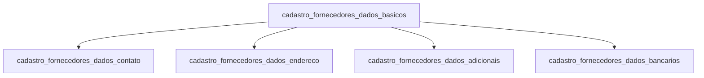

# Fornecedores — Banco Legado

Domínio de cadastro dos **fornecedores**: empresas e pessoas físicas que prestam serviços ou fornecem produtos para o grupo Sarfaty.

Diferente de clientes (cedentes) e sacados, os fornecedores não participam diretamente das operações de factoring. São entidades do módulo administrativo/financeiro da empresa.

## Relações entre tabelas

---

## `cadastro_fornecedores_dados_basicos`

**Propósito:** Identidade principal do fornecedor. Estrutura mais simples que clientes/sacados — sem dados biográficos de PF além do CPF/CNPJ.

| Coluna | Tipo | Nulável | Descrição |
|--------|------|---------|-----------|
| `id_fornecedores_dados_basicos` | `int` | PK | Identificador legado. |
| `id_fornecedor_sgs` | `int` | sim | ID no SGS — chave de rastreabilidade. |
| `id_fornecedor_nf` | `int` | sim | ID no NetFactor — chave de rastreabilidade. |
| `cpf_fornecedor` | `varchar(11)` | sim | CPF para fornecedor pessoa física. |
| `cnpj_fornecedor` | `varchar(14)` | sim | CNPJ para fornecedor pessoa jurídica. |
| `nome_fornecedor` | `varchar(200)` | sim | Nome completo (PF) ou razão social abreviada (PJ). |
| `razao_social_fornecedor` | `varchar(200)` | sim | Razão social completa (PJ). |
| `nome_fantasia_fornecedor` | `varchar(200)` | sim | Nome fantasia (PJ). |
| `cod_fornecedor_sgs` | `int` | sim | Código sequencial do fornecedor no sistema SGS. |
| `tipo_pf_pj` | `varchar(2)` | sim | `'PF'` ou `'PJ'`. |
| `status_cadastro` | `varchar(10)` | sim | Status: `ATIVO`, `INATIVO`, `EXCLUIDO`. |
| `data_carga` | `datetime2` | sim | Data de carga no Data Lake. Default: `sysutcdatetime()`. |

---

## `cadastro_fornecedores_dados_contato`

**Propósito:** Contatos múltiplos do fornecedor com suporte a múltiplos e-mails e telefones.

| Coluna | Tipo | Nulável | Descrição |
|--------|------|---------|-----------|
| `id_fornecedores_dados_contato` | `int` | PK | Identificador legado. |
| `id_fornecedor_nf` | `int` | sim | FK para o fornecedor no NetFactor. |
| `id_fornecedor_sgs` | `int` | sim | FK para o fornecedor no SGS. |
| `nome_contato` | `varchar(200)` | sim | Nome da pessoa de contato. |
| `detalhes_contato` | `varchar(500)` | sim | Observações sobre o contato. |
| `homepage` | `varchar(300)` | sim | Site do fornecedor. |
| `email` | `varchar(500)` | sim | E-mail principal. |
| `email_multiplo` | `varchar(1000)` | sim | Múltiplos e-mails separados por ponto-e-vírgula. |
| `email_bkp` | `varchar(500)` | sim | E-mail de backup. |
| `telefone` | `varchar(300)` | sim | Telefone fixo. |
| `telefone_cel` | `varchar(300)` | sim | Celular. |
| `telefone_sms` | `varchar(300)` | sim | Número SMS. |
| `telefone_fax` | `varchar(100)` | sim | Fax. |
| `status_cadastro` | `varchar(10)` | sim | Status: `ATIVO`, `INATIVO`, `EXCLUIDO`. |
| `data_carga` | `datetime2` | sim | Data de carga no Data Lake. |

---

## `cadastro_fornecedores_dados_endereco`

**Propósito:** Endereço cadastral do fornecedor (único endereço, sem variante de cobrança).

| Coluna | Tipo | Nulável | Descrição |
|--------|------|---------|-----------|
| `id_fornecedores_dados_endereco` | `int` | PK | Identificador legado. |
| `id_fornecedor_nf` | `int` | sim | FK para o fornecedor no NetFactor. |
| `id_fornecedor_sgs` | `int` | sim | FK para o fornecedor no SGS. |
| `logradouro` | `varchar(200)` | sim | Rua/avenida. |
| `sem_numero` | `bit` | sim | Endereço sem número. |
| `numero` | `varchar(20)` | sim | Número. |
| `complemento` | `varchar(100)` | sim | Complemento. |
| `cep` | `varchar(15)` | sim | CEP. |
| `bairro` | `varchar(100)` | sim | Bairro. |
| `cidade` | `varchar(100)` | sim | Cidade. |
| `estado` | `varchar(2)` | sim | UF. |
| `status_cadastro` | `varchar(10)` | sim | Status: `ATIVO`, `INATIVO`, `EXCLUIDO`. |
| `data_carga` | `datetime2` | sim | Data de carga no Data Lake. |

---

## `cadastro_fornecedores_dados_adicionais`

**Propósito:** Dados complementares do fornecedor — tipo de serviço prestado, ciclo de vida do cadastro e flags de relacionamento cruzado com outros domínios.

| Coluna | Tipo | Nulável | Descrição |
|--------|------|---------|-----------|
| `id_cadastro_fornecedores_dados_adic` | `int` | PK | Identificador legado. |
| `id_fornecedor_nf` | `int` | sim | FK para o fornecedor no NetFactor. |
| `id_fornecedor_sgs` | `int` | sim | FK para o fornecedor no SGS. |
| `dt_inclusao_forn` | `date` | sim | Data de início do relacionamento como fornecedor. |
| `dt_exclusao_forn` | `date` | sim | Data de encerramento do relacionamento. |
| `motivo_exclusao` | `varchar(200)` | sim | Motivo do encerramento (ex: encerramento de contrato, inadimplência). |
| `status_fornecedor` | `varchar(50)` | sim | Status do fornecedor no sistema operacional. |
| `cliente_sarfaty` | `bit` | sim | Este fornecedor também é cedente (cliente) da Sarfaty. |
| `sacado_sarfaty` | `bit` | sim | Este fornecedor também é sacado de operações. |
| `empresas_grupo` | `bit` | sim | Este fornecedor integra o grupo econômico Sarfaty. |
| `tipo_servico` | `varchar(100)` | sim | Categoria do serviço prestado (ex: `TI`, `Jurídico`, `Consultoria`, `Cobrança`). |
| `status_cadastro` | `varchar(10)` | sim | Status: `ATIVO`, `INATIVO`, `EXCLUIDO`. |
| `data_carga` | `datetime2` | sim | Data de carga no Data Lake. |

---

## `cadastro_fornecedores_dados_bancarios`

**Propósito:** Contas bancárias do fornecedor para pagamento de notas fiscais e serviços.

| Coluna | Tipo | Nulável | Descrição |
|--------|------|---------|-----------|
| `id_fornecedores_dados_bancarios` | `int` | PK | Identificador legado. |
| `id_fornecedor_nf` | `int` | sim | FK para o fornecedor no NetFactor. |
| `id_fornecedor_sgs` | `int` | sim | FK para o fornecedor no SGS. |
| `cpf_fornecedor` | `varchar(11)` | sim | CPF do titular (PF). |
| `cnpj_fornecedor` | `varchar(14)` | sim | CNPJ do titular (PJ). |
| `nome_fornecedor` | `varchar(200)` | sim | Nome do titular. |
| `razao_social_fornecedor` | `varchar(200)` | sim | Razão social do titular. |
| `cod_bacen` | `int` | sim | Código BACEN do banco. |
| `nome_banco` | `varchar(200)` | sim | Nome do banco. |
| `cod_agencia` | `varchar(20)` | sim | Agência. |
| `conta_digito` | `varchar(30)` | sim | Conta com dígito verificador. |
| `chave_pix` | `varchar(200)` | sim | Chave PIX. |
| `apelido_conta` | `varchar(100)` | sim | Apelido da conta para identificação rápida. |
| `data_inclusao` | `date` | sim | Data de cadastro da conta. |
| `data_exclusao` | `date` | sim | Data de encerramento da conta. |
| `status_cadastro` | `varchar(10)` | sim | Status: `ATIVO`, `INATIVO`, `EXCLUIDO`. |
| `data_carga` | `datetime2` | sim | Data de carga no Data Lake. |

---

## Observações de migração

1. **Entidade simples:** fornecedores têm estrutura mais enxuta que clientes/sacados — sem dados biográficos detalhados de PF, sem grupos econômicos próprios, sem produtos habilitados.

2. **Flags cruzadas:** os campos `cliente_sarfaty`, `sacado_sarfaty` e `empresas_grupo` indicam que a mesma entidade (CNPJ/CPF) pode existir em múltiplos domínios. No novo sistema, isso deve ser tratado com uma entidade central de `legal_entities` ou flags de papel em cada tabela, evitando duplicação de dados.

3. **Tipo de serviço:** o campo `tipo_servico` sugere uma tabela de categorias no novo sistema (enum ou tabela `supplier_categories`).

4. **Contas bancárias:** mesmo padrão que clientes e sacados — banco, agência, conta, PIX. Candidato a schema compartilhado `bank_accounts` com FK polimórfica, ou tabelas separadas por entidade seguindo o padrão do projeto.
