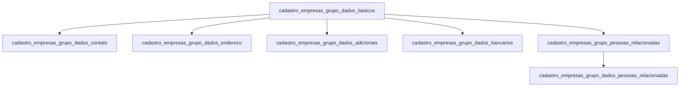

# Grupos Econômicos (Empresas do Grupo) — Banco Legado

Domínio de cadastro das **empresas do grupo Sarfaty** e entidades corporativas relacionadas.

No legado, esse domínio serve dois propósitos distintos:
1. **Empresas operadoras** (as próprias empresas da Sarfaty que operam no NetFactor — cada `nfEmpresa` é uma entidade operacional distinta)
2. **Grupos econômicos** de clientes/sacados que pertencem ao ecossistema Sarfaty

O prefixo `cadastro_empresas_grupo_` no DLSGS consolida dados das empresas do grupo que também aparecem como cedentes, sacados ou fornecedores em operações.

## Relações entre tabelas

---

## `cadastro_empresas_grupo_dados_basicos`

**Propósito:** Dados cadastrais da empresa do grupo — CNPJ, razão social, tipo de empresa, administrador e código contábil.

| Coluna | Tipo | Nulável | Descrição |
|--------|------|---------|-----------|
| `id_empresas_grupo_dados_basicos` | `int` | PK | Identificador legado. |
| `id_empresa_sgs` | `int` | sim | ID no SGS — chave de rastreabilidade. |
| `id_empresas_nf` | `int` | sim | ID no NetFactor (`nfEmpresa.empCodigo`) — chave de rastreabilidade. |
| `cnpj` | `varchar(14)` | sim | CNPJ da empresa. |
| `razao_social` | `varchar(200)` | sim | Razão social completa. |
| `nome_reduzido` | `varchar(200)` | sim | Nome reduzido para uso interno. |
| `sigla_empresa` | `varchar(50)` | sim | Sigla identificadora da empresa (ex: `SAR`, `SAR-SP`). |
| `inscricao_estadual` | `varchar(20)` | sim | Inscrição estadual. |
| `inscricao_municipal` | `varchar(20)` | sim | Inscrição municipal (para NF-e). |
| `logotipo` | `varchar(1000)` | sim | Path ou URL do logotipo da empresa. |
| `tipo_empresa_grupo` | `varchar(40)` | sim | Tipo da empresa no grupo (ex: `Factoring`, `FIDC`, `Administradora`). |
| `cnpj_administrador` | `varchar(14)` | sim | CNPJ da pessoa jurídica administradora. |
| `administrador` | `varchar(100)` | sim | Nome do administrador. |
| `codigo_contabil` | `int` | sim | Código contábil da empresa no plano de contas. |
| `status_cadastro` | `varchar(10)` | sim | Status: `ATIVO`, `INATIVO`, `EXCLUIDO`. |
| `data_carga` | `datetime2` | sim | Data de carga no Data Lake. |

---

## `cadastro_empresas_grupo_dados_contato`

**Propósito:** Dados de contato da empresa do grupo.

| Coluna | Tipo | Nulável | Descrição |
|--------|------|---------|-----------|
| `id_cadastro_empresas_grupo_dados_contato` | `int` | PK | Identificador legado. |
| `id_empresas_nf` | `int` | sim | FK para a empresa no NetFactor. |
| `id_empresa_sgs` | `int` | sim | FK para a empresa no SGS. |
| `email` | `varchar(1000)` | sim | E-mail institucional. |
| `homepage` | `varchar(200)` | sim | Site da empresa. |
| `telefone` | `varchar(300)` | sim | Telefone institucional. |
| `fax_flag` | `bit` | sim | Flag: possui fax. |
| `status_cadastro` | `varchar(10)` | sim | Status: `ATIVO`, `INATIVO`, `EXCLUIDO`. |
| `data_carga` | `datetime2` | sim | Data de carga no Data Lake. |

---

## `cadastro_empresas_grupo_dados_endereco`

**Propósito:** Endereço da sede ou filial da empresa do grupo.

| Coluna | Tipo | Nulável | Descrição |
|--------|------|---------|-----------|
| `id_cadastro_empresas_grupo_dados_endereco` | `int` | PK | Identificador legado. |
| `id_empresas_nf` | `int` | sim | FK para a empresa no NetFactor. |
| `id_empresa_sgs` | `int` | sim | FK para a empresa no SGS. |
| `logradouro` | `varchar(250)` | sim | Logradouro. |
| `sem_numero` | `bit` | sim | Sem número. |
| `numero` | `varchar(20)` | sim | Número. |
| `complemento` | `varchar(100)` | sim | Complemento. |
| `cep` | `varchar(8)` | sim | CEP. |
| `bairro` | `varchar(100)` | sim | Bairro. |
| `cidade` | `varchar(200)` | sim | Cidade. |
| `estado` | `char(2)` | sim | UF. |
| `status_cadastro` | `varchar(10)` | sim | Status: `ATIVO`, `INATIVO`, `EXCLUIDO`. |
| `data_carga` | `datetime2` | sim | Data de carga no Data Lake. |

---

## `cadastro_empresas_grupo_dados_adicionais`

**Propósito:** Flags de papel no ecossistema — indica se a empresa do grupo também opera como cedente, sacado ou fornecedor da Sarfaty.

| Coluna | Tipo | Nulável | Descrição |
|--------|------|---------|-----------|
| `id_cadastro_empresas_grupo_dados_adic` | `int` | PK | Identificador legado. |
| `id_empresas_nf` | `int` | sim | FK para a empresa no NetFactor. |
| `id_empresa_sgs` | `int` | sim | FK para a empresa no SGS. |
| `cliente_sarfaty` | `bit` | sim | A empresa também opera como cedente. |
| `sacado_sarfaty` | `bit` | sim | A empresa também é sacado em operações. |
| `fornecedor_sarfaty` | `bit` | sim | A empresa também é fornecedora. |
| `status_cadastro` | `varchar(10)` | sim | Status: `ATIVO`, `INATIVO`, `EXCLUIDO`. |
| `data_carga` | `datetime2` | sim | Data de carga no Data Lake. |

---

## `cadastro_empresas_grupo_dados_bancarios`

**Propósito:** Contas bancárias das empresas do grupo utilizadas para operações e pagamentos.

| Coluna | Tipo | Nulável | Descrição |
|--------|------|---------|-----------|
| `id_cadastro_eg_dados_bancarios` | `int` | PK | Identificador legado. |
| `id_empresas_nf` | `int` | sim | FK para a empresa no NetFactor. |
| `id_empresa_sgs` | `int` | sim | FK para a empresa no SGS. |
| `cnpj` | `varchar(14)` | sim | CNPJ da empresa titular. |
| `razao_social` | `varchar(200)` | sim | Razão social da titular. |
| `id_conta_emp_nf` | `int` | sim | ID da conta no NetFactor (`nfCedenteContaCorrente.cccCodigo`). |
| `cod_conta_emp_nf` | `int` | sim | Código sequencial da conta no NetFactor. |
| `cod_bacen` | `int` | sim | Código BACEN do banco. |
| `nome_banco` | `varchar(200)` | sim | Nome do banco. |
| `cod_agencia` | `varchar(12)` | sim | Agência. |
| `conta_digito` | `varchar(40)` | sim | Conta com dígito. |
| `chave_pix` | `varchar(200)` | sim | Chave PIX. |
| `apelido_conta` | `varchar(100)` | sim | Apelido da conta. |
| `dt_inclusao` | `date` | sim | Data de abertura. |
| `dt_exclusao` | `date` | sim | Data de encerramento. |
| `status_cadastro` | `varchar(10)` | sim | Status: `ATIVO`, `INATIVO`, `EXCLUIDO`. |
| `data_carga` | `datetime` | sim | Data de carga no Data Lake. Default: `getdate()`. |

---

## `cadastro_empresas_grupo_pessoas_relacionadas`

**Propósito:** Pessoas físicas relacionadas à empresa do grupo — sócios, administradores, procuradores e representantes legais. Versão simplificada com apenas nome e CPF.

| Coluna | Tipo | Nulável | Descrição |
|--------|------|---------|-----------|
| `id_cadastro_empresas_grupo_pessoas_rel` | `int` | PK | Identificador legado. |
| `id_empresas_nf` | `int` | sim | FK para a empresa no NetFactor. |
| `tipo_relacionamento` | `varchar(30)` | sim | Tipo: `Sócio`, `Administrador`, `Procurador`, `Representante Legal`. |
| `nome_pessoa` | `varchar(200)` | sim | Nome da pessoa. |
| `cpf_pessoa` | `varchar(14)` | sim | CPF da pessoa. |
| `status_cadastro` | `varchar(10)` | sim | Status: `ATIVO`, `INATIVO`, `EXCLUIDO`. |
| `data_carga` | `datetime2` | sim | Data de carga no Data Lake. |

---

## `cadastro_empresas_grupo_dados_pessoas_relacionadas`

**Propósito:** Versão alternativa/complementar das pessoas relacionadas — carrega o SGS como referência e mantém o tipo de relacionamento. Provavelmente uma visão de consolidação SGS + NF.

| Coluna | Tipo | Nulável | Descrição |
|--------|------|---------|-----------|
| `id_empresas_nf` | `int` | sim | FK para a empresa no NetFactor. |
| `id_empresa_sgs` | `int` | sim | FK para a empresa no SGS. |
| `nome_representante` | `varchar(200)` | sim | Nome do representante. |
| `cpf_cnpj_representante` | `varchar(14)` | sim | CPF ou CNPJ (PF ou PJ representante). |
| `tipo_relacionamento` | `varchar(30)` | sim | Tipo de relacionamento. |
| `status_cadastro` | `varchar(10)` | sim | Status: `ATIVO`, `INATIVO`, `EXCLUIDO`. |
| `data_carga` | `datetime2` | sim | Data de carga no Data Lake. |

> **Nota:** as duas tabelas de pessoas relacionadas (`pessoas_relacionadas` e `dados_pessoas_relacionadas`) são redundantes no legado — provavelmente resultado de duas fontes (SGS e NF) sem merge adequado. Na migração, devem ser unificadas em uma única tabela.

---

## Observações de migração

1. **Empresas operadoras vs. grupos econômicos:** no novo sistema, as empresas do grupo Sarfaty que operam no sistema são configuração de plataforma (não entidades de negócio). Considerar separar:
   - `companies` — empresas operadoras (entidades Sarfaty que fazem operações)
   - `economic_groups` — grupos econômicos de cedentes/sacados externos

2. **Deduplicação de pessoas relacionadas:** as duas tabelas devem ser consolidadas em `economic_group_members` com o campo `relationship_type`.

3. **Flags cruzadas:** os campos `cliente_sarfaty`, `sacado_sarfaty`, `fornecedor_sarfaty` refletem a natureza multi-papel das entidades no ecossistema. No novo design, isso é resolvido pela existência simultânea do mesmo CNPJ em `clients`, `drawees` e `suppliers`.

4. **Código contábil:** o campo `codigo_contabil` sugere integração com sistema de contabilidade — preservar como `accounting_code` na entidade correspondente.
