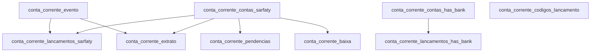

# Conta Corrente — Banco Legado

Domínio financeiro de **conta corrente** dos clientes (cedentes) na Sarfaty. Registra contas abertas, lançamentos, extratos, pendências e a correspondência com contas em bancos parceiros (especialmente BMP — banco digital parceiro da Sarfaty).

Este domínio é o coração do módulo financeiro operacional — toda movimentação financeira de um cedente passa pelo extrato de conta corrente.

## Relações entre tabelas

---

## `conta_corrente_contas_sarfaty`

**Propósito:** Contas correntes dos cedentes na Sarfaty — não necessariamente contas bancárias reais, mas "contas gráficas" internas que registram o saldo e movimentações de cada cliente no sistema.

| Coluna | Tipo | Nulável | Descrição |
|--------|------|---------|-----------|
| `ID_conta_corrente_contas_sarfaty` | `int` | PK | Identificador legado. |
| `ID_NetFactor` | `int` | sim | ID do cedente no NetFactor. |
| `ID_SGS` | `int` | sim | ID do cedente no SGS. |
| `CPF` | `varchar(11)` | sim | CPF do titular (PF). |
| `CNPJ` | `varchar(14)` | sim | CNPJ do titular (PJ). |
| `CNPJ_Raiz` | `varchar(8)` | sim | Raiz do CNPJ para agrupar filiais. |
| `Banco_Nome` | `varchar(100)` | sim | Nome do banco da conta real associada. |
| `Banco_Codigo` | `varchar(4)` | sim | Código BACEN. |
| `Agencia` | `varchar(4)` | sim | Agência. |
| `Conta_Digito` | `varchar(20)` | sim | Conta com dígito. |
| `Tipo` | `varchar(50)` | sim | Tipo da conta: `Corrente`, `Poupança`, `Gráfica`. |
| `Data_Abertura_Conta` | `date` | sim | Data de abertura. |
| `Data_Encerramento_Conta` | `date` | sim | Data de encerramento. |
| `Status_Conta` | `varchar(50)` | sim | Status: `Ativa`, `Encerrada`, `Bloqueada`. |
| `Tipo_de_Bloqueio` | `varchar(50)` | sim | Tipo de bloqueio quando aplicável. |
| `Motivo_Encerramento` | `varchar(MAX)` | sim | Motivo do encerramento. |
| `Tarifas` | `decimal(18,4)` | sim | Tarifas mensais associadas à conta. |
| `Nome` | `varchar(255)` | sim | Nome do titular. |
| `Razao_Social` | `varchar(255)` | sim | Razão social do titular (PJ). |
| `Nome_da_Conta` | `varchar(255)` | sim | Apelido/nome da conta para identificação. |

---

## `conta_corrente_lancamentos_sarfaty`

**Propósito:** Lançamentos financeiros no sistema Sarfaty (NetFactor/SGS) — recibos de operações, pagamentos, tarifas e demais créditos/débitos. É a origem dos dados para o extrato.

| Coluna | Tipo | Nulável | Descrição |
|--------|------|---------|-----------|
| `ID_conta_corrente_lancamentos_recibo` | `int` | PK | Identificador legado. |
| `ID_NetFactor` | `int` | sim | ID do cedente no NetFactor. |
| `ID_SGS` | `int` | sim | ID do cedente no SGS. |
| `CPF` | `varchar(11)` | sim | CPF do titular. |
| `CNPJ` | `varchar(14)` | sim | CNPJ do titular. |
| `CNPJ_Raiz` | `varchar(8)` | sim | Raiz CNPJ. |
| `Codigo_RP_NF` | `int` | sim | Código do recibo/pagamento no NetFactor. |
| `Codigo_Empresa_Recibo_NF` | `int` | sim | Código da empresa que gerou o lançamento no NF. |
| `Data_Recibo_NF` | `date` | sim | Data do lançamento no NetFactor. |
| `Valor_Recibo_NF` | `decimal(18,4)` | sim | Valor do lançamento. |
| `Descricao_NF` | `varchar(MAX)` | sim | Descrição do lançamento no NetFactor. |
| `Codigo_SGS_Recibo` | `int` | sim | Código correspondente no SGS. |
| `Descricao_SGS_Recibo` | `varchar(MAX)` | sim | Descrição do lançamento no SGS. |
| `Tipo_SGS_Recibo` | `varchar(50)` | sim | Tipo do lançamento no SGS: `D` (débito) ou `C` (crédito). |

---

## `conta_corrente_extrato`

**Propósito:** Visão consolidada do extrato — cada linha une o lançamento (`LCTO`) com sua respectiva baixa (`BAIXA`), calculando o saldo acumulado. É o que o cedente visualiza no extrato de conta.

| Coluna | Tipo | Nulável | Descrição |
|--------|------|---------|-----------|
| `ID_conta_corrente_extrato` | `int` | PK | Identificador legado. |
| `ID_NetFactor` | `int` | sim | ID do cedente. |
| `ID_SGS` | `int` | sim | ID do cedente no SGS. |
| `CPF` | `varchar(11)` | sim | CPF do titular. |
| `CNPJ` | `varchar(14)` | sim | CNPJ do titular. |
| `CNPJ_Raiz` | `varchar(8)` | sim | Raiz CNPJ. |
| `Codigo_RP_NF` | `int` | sim | Código do recibo no NetFactor. |
| `Codigo_Empresa_Recibo_NF` | `int` | sim | Código da empresa. |
| `Data_Lancamento_LCTO` | `date` | sim | Data do lançamento original. |
| `Valor_LCTO` | `decimal(18,4)` | sim | Valor do lançamento. |
| `Codigo_SGS_LCTO` | `int` | sim | Código do lançamento no SGS. |
| `Nome_Lancamento_SGS` | `varchar(255)` | sim | Nome do tipo de lançamento no SGS. |
| `Descricao_SGS_LCTO` | `varchar(MAX)` | sim | Descrição do lançamento no SGS. |
| `Tipo_SGS_LCTO` | `varchar(50)` | sim | Tipo: `D` (débito) ou `C` (crédito). |
| `Data_Lancamento_BAIXA` | `date` | sim | Data da baixa/liquidação do lançamento. |
| `Valor_BAIXA` | `decimal(18,4)` | sim | Valor da baixa. |
| `Codigo_SGS_BAIXA` | `int` | sim | Código da baixa no SGS. |
| `Descricao_SGS_BAIXA` | `varchar(MAX)` | sim | Descrição da baixa. |
| `Tipo_SGS_BAIXA` | `varchar(50)` | sim | Tipo da baixa. |
| `Saldo_Acumulado` | `varchar(255)` | sim | Saldo após o lançamento (armazenado como string legado). |
| `Data_Ultima_Movimentacao` | `date` | sim | Data da última movimentação na conta. |

---

## `conta_corrente_evento`

**Propósito:** Tabela de-para entre os códigos de evento do NetFactor e do SGS. Define o tipo de lançamento (débito/crédito) associado a cada evento. É uma tabela de configuração/domínio.

| Coluna | Tipo | Nulável | Descrição |
|--------|------|---------|-----------|
| `ID_conta_corrente_evento` | `int` | PK | Identificador legado. |
| `Codigo_Evento_NF` | `int` | sim | Código do evento no NetFactor. |
| `Codigo_Evento_SGS` | `int` | sim | Código correspondente no SGS. |
| `Tipo_Lancamento` | `char(1)` | sim | Natureza do lançamento: `'D'` (débito) ou `'C'` (crédito). |
| `Descricao_Evento_SGS` | `varchar(255)` | sim | Descrição do evento (ex: `Efetivação de Operação`, `Baixa de Título`, `Tarifa`). |

---

## `conta_corrente_baixa`

**Propósito:** Registro de baixas de lançamentos — quando um lançamento em aberto é liquidado (total ou parcialmente), a baixa é registrada aqui.

| Coluna | Tipo | Nulável | Descrição |
|--------|------|---------|-----------|
| `ID_conta_corrente_baixa` | `int` | PK | Identificador legado. |
| `ID_NetFactor` | `int` | sim | ID do cedente. |
| `ID_SGS` | `int` | sim | ID no SGS. |
| `CPF` | `varchar(11)` | sim | CPF do titular. |
| `CNPJ` | `varchar(14)` | sim | CNPJ do titular. |
| `CNPJ_Raiz` | `varchar(8)` | sim | Raiz CNPJ. |
| `Codigo_RP_NF` | `int` | sim | Código do lançamento original no NF. |
| `Data_Recibo_NF` | `date` | sim | Data do lançamento original. |
| `Valor_Recibo_NF` | `decimal(18,4)` | sim | Valor do lançamento. |
| `Codigo_SGS_Recibo` | `int` | sim | Código no SGS. |
| `Tipo_SGS_Recibo` | `varchar(50)` | sim | Tipo no SGS. |
| `Descricao_NF` | `varchar(MAX)` | sim | Descrição da operação original. |
| `Valor_Baixa_NF` | `decimal(18,4)` | sim | Valor efetivamente baixado. |
| `Codigo_Pendencia_NF` | `int` | sim | FK para a pendência que foi baixada. |
| `Codigo_SGS` | `int` | sim | Código da baixa no SGS. |
| `Descricao_SGS` | `varchar(MAX)` | sim | Descrição da baixa no SGS. |
| `Tipo_SGS` | `varchar(50)` | sim | Tipo da baixa. |

---

## `conta_corrente_codigos_lancamento`

**Propósito:** Tabela de-para dos códigos de lançamento entre NetFactor e SGS, com os respectivos códigos contábeis. É uma tabela de configuração/domínio essencial para a integração financeira.

| Coluna | Tipo | Nulável | Descrição |
|--------|------|---------|-----------|
| `ID_conta_corrente_codigos_lancamento` | `int` | PK | Identificador legado. |
| `Codigo_Lancamento_NF` | `int` | sim | Código do tipo de lançamento no NetFactor. |
| `Descricao_Codigo_Lancamento_NF` | `varchar(MAX)` | sim | Descrição no NetFactor. |
| `CContabil_NF` | `int` | sim | Conta contábil associada no NF. |
| `Descricao_CContabil_NF` | `varchar(MAX)` | sim | Descrição da conta contábil no NF. |
| `Tipo_Lancamento_NF` | `varchar(MAX)` | sim | Tipo no NF: `D` ou `C`. |
| `Codigo_Lancamento_SGS` | `int` | sim | Código correspondente no SGS. |
| `Descricao_Codigo_Lancamento_SGS` | `varchar(MAX)` | sim | Descrição no SGS. |
| `CContabil_SGS` | `int` | sim | Conta contábil no SGS. |
| `Descricao_CContabil_SGS` | `varchar(MAX)` | sim | Descrição da conta contábil no SGS. |
| `Tipo_Lancamento_SGS` | `varchar(MAX)` | sim | Tipo no SGS. |
| `Nome_Lancamento_SGS` | `varchar(MAX)` | sim | Nome do lançamento no SGS. |
| `Status_Lancamento_SGS` | `varchar(50)` | sim | Status: `Ativo`, `Inativo`. |

---

## `conta_corrente_contas_has_bank`

**Propósito:** Contas bancárias dos cedentes no banco BMP (banco digital parceiro). Diferente das contas internas Sarfaty — aqui são contas reais no sistema bancário.

| Coluna | Tipo | Nulável | Descrição |
|--------|------|---------|-----------|
| `ID_conta_corrente_contas_has_bank` | `int` | PK | Identificador legado. |
| `ID_NetFactor` | `int` | sim | ID do cedente no NetFactor. |
| `ID_SGS` | `int` | sim | ID no SGS. |
| `CPF_BMP` | `varchar(11)` | sim | CPF do titular no BMP. |
| `CNPJ_BMP` | `varchar(14)` | sim | CNPJ do titular no BMP. |
| `CNPJ_Raiz_BMP` | `varchar(8)` | sim | Raiz CNPJ BMP. |
| `Nome_BMP` | `varchar(100)` | sim | Nome do titular no BMP. |
| `Razao_Social_BMP` | `varchar(100)` | sim | Razão social no BMP. |
| `Banco_Nome` | `varchar(100)` | sim | Nome do banco (geralmente BMP). |
| `Banco_Codigo` | `varchar(4)` | sim | Código BACEN do BMP. |
| `Agencia` | `varchar(4)` | sim | Agência. |
| `Conta_Digito` | `varchar(20)` | sim | Conta com dígito. |
| `Tipo` | `varchar(50)` | sim | Tipo da conta. |
| `Data_Abertura_Conta` | `date` | sim | Data de abertura. |
| `Data_Encerramento_Conta` | `date` | sim | Data de encerramento. |
| `Status_Conta` | `varchar(50)` | sim | Status. |
| `Tipo_de_Bloqueio` | `varchar(50)` | sim | Tipo de bloqueio. |
| `Motivo_Encerramento` | `varchar(MAX)` | sim | Motivo de encerramento. |
| `Tarifas_BMP` | `decimal(18,4)` | sim | Tarifas do BMP. |

---

## `conta_corrente_lancamentos_has_bank`

**Propósito:** Lançamentos nas contas BMP — integração bancária real. Inclui dados de PIX, NSU, código de transação, origem e dados do banco remetente.

| Coluna | Tipo | Nulável | Descrição |
|--------|------|---------|-----------|
| `ID_conta_corrente_lancamentos_has` | `int` | PK | Identificador legado. |
| `ID_SGS` | `int` | sim | ID no SGS. |
| `ID_NetFactor` | `int` | sim | ID no NetFactor. |
| `CPF_BMP` / `CNPJ_BMP` | `varchar` | sim | Documentos do titular. |
| `CNPJ_Raiz_BMP` | `varchar(8)` | sim | Raiz CNPJ. |
| `Banco_Codigo` | `varchar(4)` | sim | Banco. |
| `Agencia` | `varchar(4)` | sim | Agência. |
| `Conta_Digito` | `varchar(20)` | sim | Conta. |
| `Codigo` | `varchar(50)` | sim | Código interno da transação. |
| `CodigoTransacao` | `varchar(50)` | sim | Código de transação do banco. |
| `Data` | `date` | sim | Data do lançamento. |
| `Data_UTC` | `datetime` | sim | Data/hora em UTC. |
| `Descricao` | `varchar(MAX)` | sim | Descrição da transação. |
| `Tipo` | `varchar(50)` | sim | Tipo: `D` (débito) ou `C` (crédito). |
| `Valor` | `decimal(18,4)` | sim | Valor da transação. |
| `NSU` | `bigint` | sim | Número Sequencial Único da transação bancária. |
| `Codigo_Oper_Cliente` | `varchar(255)` | sim | Código da operação do cliente. |
| `Desc_Cliente` | `varchar(255)` | sim | Descrição da operação. |
| `Operador` | `varchar(MAX)` | sim | Operador que efetuou. |
| `Origem_Transacao` | `int` | sim | Código da origem (canal: app, internet banking, etc.). |
| `Banco_Origem` | `int` | sim | Banco do remetente (TEDs/PIX recebidos). |
| `Agencia_Origem` | `int` | sim | Agência do remetente. |
| `Conta_Origem_Digito` | `varchar(20)` | sim | Conta do remetente. |
| `Codigo_Lancamento` | `varchar(MAX)` | sim | Código do tipo de lançamento. |
| `Codigo_Lancamento_SGS` | `int` | sim | Código correspondente no SGS. |
| `Descricao_Lancamento` | `varchar(MAX)` | sim | Descrição do tipo de lançamento. |
| `Origem_Movimento` | `varchar(MAX)` | sim | Origem do movimento (manual, automático, etc.). |
| `Complemento_BMP` | `varchar(255)` | sim | Campo complementar do BMP. |
| `PIX_QRCODE` | `varchar(50)` | sim | QR Code ou chave PIX utilizada. |
| `Saldo_BMP` | `decimal(18,4)` | sim | Saldo após o lançamento no BMP. |
| `Data_Ultima_Movimentacao` | `date` | sim | Data da última movimentação. |
| `Nome_BMP` / `Razao_Social_BMP` | `varchar(255)` | sim | Dados do titular no BMP. |
| `Nome_Conta` | `varchar(255)` | sim | Apelido da conta. |
| `Nome_Lancamento_SGS` | `varchar(100)` | sim | Nome do lançamento no SGS. |
| `Ordem_Saldo` | `int` | sim | Sequencial para ordenação correta do saldo. |

---

## `conta_corrente_pendencias`

**Propósito:** Pendências financeiras em aberto — valores que o cedente deve à Sarfaty (ou a Sarfaty deve ao cedente), associados a operações específicas. Combina dados do NetFactor e SGS com dados do extrato BMP.

| Coluna | Tipo | Nulável | Descrição |
|--------|------|---------|-----------|
| `ID_conta_corrente_pendencias` | `int` | PK | Identificador legado. |
| `ID_NetFactor` | `int` | sim | ID do cedente. |
| `ID_SGS` | `int` | sim | ID no SGS. |
| `CPF` / `CNPJ` / `CNPJ_Raiz` | `varchar` | sim | Documentos do titular. |
| `Codigo_Cedente_NF` | `int` | sim | Código do cedente no NF. |
| `Codigo_RP_NF` | `int` | sim | Código do recibo/pagamento da origem. |
| `Codigo_Empresa_NF` | `int` | sim | Empresa operadora. |
| `Codigo_Sacado_NF` | `int` | sim | Sacado relacionado à pendência. |
| `Codigo_Pendencia_NF` | `int` | sim | Código da pendência no NetFactor. |
| `Codigo_Evento_NF` | `int` | sim | Evento que gerou a pendência. |
| `Data_Pendencia_NF` | `date` | sim | Data de geração da pendência. |
| `Valor_Original_NF` | `decimal(18,4)` | sim | Valor original da pendência. |
| `Data_Liquidacao_NF` | `date` | sim | Data de liquidação (se liquidada). |
| `Valor_Liquidado_NF` | `decimal(18,4)` | sim | Valor efetivamente liquidado. |
| `Valor_Corrigido_NF` | `decimal(18,4)` | sim | Valor corrigido com juros/multa. |
| `Historico` | `varchar(MAX)` | sim | Histórico/observação da pendência. |
| `Descricao_NF` | `varchar(MAX)` | sim | Descrição. |
| `Codigo_Empresa_Recibo_NF` | `int` | sim | Empresa do recibo. |
| `Data_Recibo_NF` | `date` | sim | Data do recibo. |
| `Valor_Recibo_NF` | `decimal(18,4)` | sim | Valor do recibo. |
| `Codigo_SGS` | `int` | sim | Código no SGS. |
| `Descricao_SGS` | `varchar(MAX)` | sim | Descrição no SGS. |
| `Tipo_SGS` | `varchar(50)` | sim | Tipo no SGS. |
| `Eh_Estorno` | `varchar(10)` | sim | Indica se é um estorno. |
| `Valor_Extrato` | `decimal(18,4)` | sim | Valor exibido no extrato. |
| `Data_Ultima_Movimentacao` | `date` | sim | Última movimentação. |
| `Data_Extrato` | `datetime` | sim | Data/hora de inclusão no extrato. |
| `Codigo_Extrato` | `varchar(250)` | sim | Código do registro no extrato. |
| `Ordem_Saldo` | `int` | sim | Sequencial para ordenação. |
| `IDtabela_rp_nf` | `int` | sim | ID interno de referência cruzada. |
| `IDtabela_pen_nf` | `int` | sim | ID interno da pendência original. |

---

## Observações de migração

1. **Sarfaty vs. BMP:** o domínio tem duas perspectivas — contas "gráficas" internas (Sarfaty) e contas reais bancárias (BMP). No novo sistema, representar como: `financial_accounts` (conta interna) com FK opcional para `bank_accounts` (conta real).

2. **Saldo como string:** `Saldo_Acumulado varchar(255)` é um problema legado — saldo deve ser `numeric(18,4)` no novo schema.

3. **Eventos como domínio:** `conta_corrente_evento` é uma tabela de configuração que define o catálogo de tipos de lançamento. No novo sistema, transformar em enum ou tabela `transaction_event_types`.

4. **Pendências:** `conta_corrente_pendencias` combina dados do NF e do SGS e do BMP — na migração, deve ser separada em: `financial_pendencies` (pendências em aberto) e `financial_settlements` (baixas).

5. **NSU e PIX:** campos modernos como `NSU`, `PIX_QRCODE` indicam que o legado já foi adaptado para integração bancária moderna — preservar esses campos na migração.
