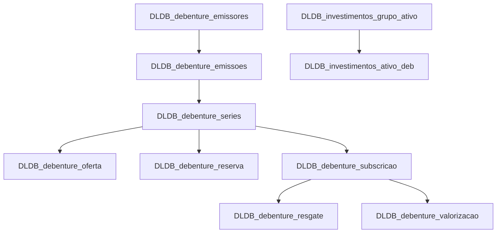

# Debêntures e Investimentos — Banco Legado

Domínio de **debêntures** emitidas pelo grupo Sarfaty e comercializadas para investidores (debenturistas). As debêntures são títulos de dívida corporativa — a Sarfaty capta recursos de investidores emitindo debêntures e utiliza esses recursos para financiar suas operações de factoring.

O prefixo `DLDB_` indica que são tabelas do Data Lake focadas em debêntures (`DB` = Debêntures).

## Fluxo de uma debênture

```
Emissor (DLDB_debenture_emissores)
  └── Emissão (DLDB_debenture_emissoes)
        └── Série (DLDB_debenture_series)
              ├── Oferta Pública (DLDB_debenture_oferta)
              ├── Reserva (DLDB_debenture_reserva)
              └── Subscrição (DLDB_debenture_subscricao)
                    ├── Resgate (DLDB_debenture_resgate)
                    └── Valorização Diária (DLDB_debenture_valorizacao)
```

## Relações entre tabelas



---

## `DLDB_debenture_emissores`

**Propósito:** Entidades que emitem as debêntures — normalmente empresas do grupo Sarfaty.

| Coluna | Tipo | Nulável | Descrição |
|--------|------|---------|-----------|
| `Codigo_Emissor_SGS` | `int` | sim | ID do emissor no SGS — chave de rastreabilidade. |
| `CNPJ_Emissor` | `varchar(18)` | sim | CNPJ da empresa emissora. |
| `Nome_Emissor` | `varchar(200)` | sim | Razão social do emissor. |
| `Logradouro` | `varchar(200)` | sim | Endereço do emissor. |
| `Sem_Numero` | `bit` | sim | Sem número. |
| `Numero` | `int` | sim | Número. |
| `Complemento` | `varchar(100)` | sim | Complemento. |
| `CEP` | `varchar(10)` | sim | CEP. |
| `Bairro` | `varchar(100)` | sim | Bairro. |
| `Cidade` | `varchar(100)` | sim | Cidade. |
| `Estado` | `char(2)` | sim | UF. |
| `Banco` | `int` | sim | Código BACEN do banco do emissor. |
| `Agencia` | `int` | sim | Agência bancária. |
| `Conta` | `int` | sim | Conta bancária. |
| `Digito` | `int` | sim | Dígito verificador. |
| `Status_Emissor` | `varchar(50)` | sim | Status: `Ativo`, `Inativo`. |
| `Data_Inclusao` | `datetime` | sim | Data de cadastro do emissor. |

---

## `DLDB_debenture_emissoes`

**Propósito:** Cada emissão de debêntures — define as características gerais da captação: tipo de rendimento, quantidade total, valor unitário (PU), penalidades e status.

| Coluna | Tipo | Nulável | Descrição |
|--------|------|---------|-----------|
| `Codigo_Ativo` | `int` | sim | Código do ativo no sistema. |
| `Nome_Ativo` | `varchar(200)` | sim | Nome do ativo (ex: `DEB SARFATY 1ª EMISSÃO`). |
| `Tipo_Rendimento` | `varchar(50)` | sim | Tipo: `CDI`, `IPCA`, `Prefixado`, etc. |
| `Codigo_Emissor` | `int` | sim | FK para `DLDB_debenture_emissores`. |
| `Nome_Emissor` | `varchar(200)` | sim | Nome do emissor (desnormalizado). |
| `CNPJ_Emissor` | `varchar(18)` | sim | CNPJ do emissor. |
| `Numero_Emissao` | `int` | sim | Número sequencial da emissão (1ª, 2ª, etc.). |
| `ID_Emissao_SGS` | `int` | sim | ID da emissão no SGS. |
| `ID_Emissao_NetFactor` | `int` | sim | ID da emissão no NetFactor. |
| `Data_Emissao` | `datetime` | sim | Data de emissão dos títulos. |
| `Tipo_Emissao` | `varchar(50)` | sim | Default `'Privada'` — tipo de oferta. |
| `Especie_Emissao` | `varchar(50)` | sim | Default `'Subordinada'` — espécie da debênture. |
| `Forma_Emissao` | `varchar(100)` | sim | Default `'Nominativa, Não Endossável, com Emissão de Cautela'`. |
| `Data_Vencimento` | `datetime` | sim | Data de vencimento final da emissão. |
| `Prazo_Integralizacao` | `int` | sim | Prazo em dias para integralização. |
| `Prazo_Final_Integralizacao` | `datetime` | sim | Data limite para integralização. |
| `Quantidade_Emissao` | `int` | sim | Quantidade total de títulos emitidos. |
| `Quantidade_Series_Emissao` | `int` | sim | Número de séries desta emissão. |
| `Valor_Emissao` | `numeric(15,2)` | sim | Valor total da emissão (R$). |
| `PU_Emissao` | `numeric(15,2)` | sim | Preço unitário de emissão por título (R$). |
| `Percentual_Multa` | `numeric(5,2)` | sim | Percentual de multa por resgate antecipado. |
| `Percentual_Mora` | `numeric(5,2)` | sim | Percentual de juros de mora. |
| `Saldo_Emissao` | `numeric(15,2)` | sim | Saldo atual da emissão (total não resgatado). |
| `Status_Emissao` | `varchar(50)` | sim | Status: `Aberta`, `Encerrada`, `Em Captação`. |
| `Documento_Emissao` | `varbinary` | sim | Escritura da emissão (binário). Migrar para Supabase Storage. |
| `Documento_AGE` | `varbinary` | sim | Ata da AGE que aprovou a emissão (binário). Migrar para Supabase Storage. |

---

## `DLDB_debenture_series`

**Propósito:** Séries de uma emissão. Uma emissão pode ter múltiplas séries com características distintas de rentabilidade, prazo e público.

| Coluna | Tipo | Nulável | Descrição |
|--------|------|---------|-----------|
| `Numero_Emissao` | `int` | sim | FK para a emissão. |
| `Numero_Serie` | `int` | sim | Número da série (1, 2, 3...). |
| `Nome_Ativo` | `varchar(200)` | sim | Nome do ativo (desnormalizado). |
| `ID_Emissao_NetFactor` | `int` | sim | ID da emissão no NF. |
| `ID_Emissao_SGS` | `int` | sim | ID da emissão no SGS. |
| `ID_Serie_NetFactor` | `int` | sim | ID da série no NF. |
| `ID_Serie_SGS` | `int` | sim | ID da série no SGS. |
| `Quantidade_Serie` | `int` | sim | Quantidade de títulos nesta série. |
| `Indice` | `varchar(50)` | sim | Índice de referência: `CDI`, `IPCA`, `Prefixado`. |
| `Taxa_Emissao` | `numeric(15,4)` | sim | Taxa contratada (% a.a. ou % do CDI). |
| `Desvio_Padrao` | `numeric(15,4)` | sim | Desvio padrão para cálculo de risco. |
| `Vencimento_Serie` | `datetime` | sim | Data de vencimento da série. |
| `Quantidade_Saldo_Serie` | `int` | sim | Quantidade de títulos ainda em circulação. |
| `Publico_Alvo` | `varchar(50)` | sim | Público-alvo: `Geral`, `Qualificado`, `Profissional`. |
| `Publicar_WEB` | `bit` | sim | Exibir no portal do debenturista. |
| `Permite_Resgate_WEB` | `bit` | sim | Permite solicitação de resgate pelo portal. |
| `Status_Serie` | `varchar(50)` | sim | Status: `Aberta`, `Encerrada`. |

---

## `DLDB_debenture_oferta`

**Propósito:** Configuração de oferta pública de uma série — idêntica à `DLDB_debenture_series` com campos adicionais de publicação web. Parece ser uma visão especializada para controle de ofertas abertas ao investidor.

Mesmas colunas de `DLDB_debenture_series`. Adicionalmente:

| Coluna extra | Tipo | Nulável | Descrição |
|---|---|---|---|
| `Percentual_Indice` | `numeric(15,4)` | sim | Percentual do índice contratado (ex: 120% do CDI). |

---

## `DLDB_debenture_reserva`

**Propósito:** Reservas feitas por debenturistas antes da subscrição formal — intenção de compra registrada com quantidade e valor.

| Coluna | Tipo | Nulável | Descrição |
|--------|------|---------|-----------|
| `CPF` | `varchar(11)` | sim | CPF do debenturista (PF). |
| `CNPJ` | `varchar(14)` | sim | CNPJ do debenturista (PJ). |
| `ID_Debenturista_NetFactor` | `int` | sim | ID do debenturista no NF. |
| `ID_Debenturista_SGS` | `int` | sim | ID do debenturista no SGS. |
| `Numero_Emissao` | `int` | sim | FK para a emissão. |
| `Numero_Serie` | `int` | sim | FK para a série. |
| `Nome_Ativo` | `varchar(200)` | sim | Nome do ativo. |
| `ID_Emissao_NetFactor` / `ID_Emissao_SGS` | `int` | sim | IDs de rastreabilidade da emissão. |
| `ID_Serie_NetFactor` / `ID_Serie_SGS` | `int` | sim | IDs de rastreabilidade da série. |
| `ID_Reserva_SGS` | `int` | sim | ID da reserva no SGS. |
| `Data_Vencimento` | `date` | sim | Vencimento da série reservada. |
| `PU_Emissao` | `numeric(15,2)` | sim | PU no momento da reserva. |
| `Indice` | `varchar(50)` | sim | Índice da série. |
| `Taxa_Emissao` | `numeric(7,4)` | sim | Taxa da série. |
| `ID_Reserva_NetFactor` | `int` | sim | ID da reserva no NF. |
| `Data_Reserva` | `date` | sim | Data da solicitação de reserva. |
| `Quantidade_Reservada` | `int` | sim | Quantidade de títulos reservados. |
| `Valor_Reserva` | `numeric(15,2)` | sim | Valor financeiro da reserva. |
| `Boletim_Subscricao` | `varbinary` | sim | Boletim de subscrição assinado. Migrar para Storage. |
| `Cautela_Subscricao` | `varbinary` | sim | Cautela da subscrição. Migrar para Storage. |
| `Status_Reserva` | `varchar(50)` | sim | Status: `Pendente`, `Convertida`, `Cancelada`. |

---

## `DLDB_debenture_subscricao`

**Propósito:** Subscrições efetivadas — o debenturista se comprometeu formalmente com a compra de uma quantidade de títulos.

| Coluna | Tipo | Nulável | Descrição |
|--------|------|---------|-----------|
| `CPF` / `CNPJ` | `varchar` | sim | Documento do debenturista. |
| `ID_Debenturista_NetFactor` / `ID_Debenturista_SGS` | `int` | sim | IDs do debenturista. |
| `Numero_Emissao` / `Numero_Serie` | `int` | sim | FKs de emissão e série. |
| `ID_Emissao_*` / `ID_Serie_*` | `int` | sim | IDs de rastreabilidade. |
| `Data_Vencimento` | `datetime` | sim | Vencimento da série subscrita. |
| `PU_Emissao` | `numeric(16,7)` | sim | PU na data da subscrição (7 casas decimais para precisão). |
| `Indice` | `varchar(50)` | sim | Índice da série. |
| `Taxa_Emissao` | `numeric(15,4)` | sim | Taxa contratada. |
| `ID_Subscricao_NetFactor` | `int` | sim | ID da subscrição no NF. |
| `ID_Subscricao_SGS` | `int` | sim | ID da subscrição no SGS. |
| `Data_Subscricao` | `datetime` | sim | Data da subscrição. |
| `Quantidade_Titulos` | `int` | sim | Quantidade de títulos subscritos. |
| `Valor_Subscricao` | `numeric(15,2)` | sim | Valor financeiro integralizado. |
| `Quantidade_Resgatada` | `int` | sim | Quantidade já resgatada desta subscrição. |
| `Estoque_Atual` | `int` | sim | Quantidade ainda em poder do debenturista. |

---

## `DLDB_debenture_resgate`

**Propósito:** Resgates de debêntures — total ou parcial. Calcula o rendimento obtido, IR e IOF devidos e o valor líquido pago ao debenturista.

| Coluna | Tipo | Nulável | Descrição |
|--------|------|---------|-----------|
| `CPF` / `CNPJ` | `varchar` | sim | Documento do debenturista. |
| `ID_Debenturista_NetFactor` / `ID_Debenturista_SGS` | `int` | sim | IDs de rastreabilidade. |
| `ID_Subscricao_NetFactor` / `ID_Subscricao_SGS` | `int` | sim | FKs da subscrição resgatada. |
| `ID_Cautela_NetFactor` / `ID_Cautela_SGS` | `int` | sim | IDs da cautela (certificado). |
| `Data_Subscricao` | `datetime` | sim | Data original da subscrição. |
| `ID_Resgate_NetFactor` | `int` | sim | ID do resgate no NF. |
| `ID_Resgate_SGS` | `int` | sim | ID do resgate no SGS. |
| `Data_Solicitacao_Resgate` | `datetime` | sim | Data da solicitação pelo investidor. |
| `Data_Resgate` | `datetime` | sim | Data de processamento do resgate. |
| `Data_Liquidacao` | `datetime` | sim | Data de pagamento ao investidor. |
| `Quantidade_Resgatada` | `int` | sim | Quantidade de títulos resgatados. |
| `Valor_Liquido_Solicitado` | `numeric(15,2)` | sim | Valor líquido solicitado pelo investidor. |
| `PU_Aplicacao` | `numeric(15,2)` | sim | PU na data da subscrição original. |
| `PU_Resgate` | `numeric(15,2)` | sim | PU na data do resgate. |
| `Valor_Aplicado` | `numeric(15,2)` | sim | Valor original aplicado. |
| `Valor_Bruto_Resgate` | `numeric(15,2)` | sim | Valor bruto do resgate (sem impostos). |
| `Rendimento_Bruto_Resgate` | `numeric(15,2)` | sim | Rendimento bruto = Valor Bruto - Valor Aplicado. |
| `IR_Resgate` | `numeric(15,2)` | sim | Imposto de Renda retido. |
| `IOF_Resgate` | `numeric(15,2)` | sim | IOF retido. |
| `Valor_Liquido_Resgate` | `numeric(15,2)` | sim | Valor líquido pago = Bruto - IR - IOF. |
| `Rendimento_Liquido_Resgate` | `numeric(15,2)` | sim | Rendimento líquido após impostos. |
| `Aliquota_IR_Resgate` | `numeric(5,2)` | sim | Alíquota de IR aplicada (%). |
| `Dias_IOF_Resgate` | `int` | sim | Dias corridos para cálculo do IOF. |
| `Dias_Corridos` | `int` | sim | Total de dias da aplicação. |
| `Rentabilidade_Resgate` | `numeric(7,4)` | sim | Rentabilidade percentual do período. |
| `Status_Resgate` | `int` | sim | Status: `0=Pendente`, `1=Processado`, `2=Liquidado`. |
| `Aliquota_IOF_Resgate` | `numeric(5,2)` | sim | Alíquota de IOF aplicada (%). |

---

## `DLDB_debenture_valorizacao`

**Propósito:** Valorização diária de cada posição de subscrição em aberto. É o histórico de cotas/PU calculados diariamente, usado para o extrato do debenturista.

| Coluna | Tipo | Nulável | Descrição |
|--------|------|---------|-----------|
| `CPF` / `CNPJ` | `varchar` | sim | Documento do debenturista. |
| `ID_Debenturista_*` / `ID_Subscricao_*` | `int` | sim | IDs de rastreabilidade. |
| `Data_Subscricao` | `datetime` | sim | Data da subscrição (origem da posição). |
| `Data_Valorizacao` | `datetime` | sim | Data do cálculo de valorização (D). |
| `Data_Vencimento` | `datetime` | sim | Vencimento da série. |
| `Indice` | `varchar(50)` | sim | Índice de referência. |
| `Taxa_Emissao` | `numeric(15,4)` | sim | Taxa contratada. |
| `Taxa_Emissao_Capitalizada` | `numeric(15,4)` | sim | Taxa capitalizada até D. |
| `Indice_Dia_Taxa` | `decimal(18,16)` | sim | Fator diário do índice (alta precisão). |
| `Valor_Bruto_Dia_Anterior` | `numeric(15,2)` | sim | Valor bruto em D-1. |
| `Rentabilidade_Dia` | `numeric(15,4)` | sim | Rentabilidade do dia (%). |
| `Rentabilidade_Mes` | `numeric(15,4)` | sim | Rentabilidade acumulada no mês. |
| `Rentabilidade_Mes_Anterior` | `numeric(15,4)` | sim | Rentabilidade do mês anterior. |
| `Rentabilidade_Acumulada` | `numeric(15,4)` | sim | Rentabilidade desde a subscrição. |
| `PU_Emissao` | `numeric(15,2)` | sim | PU original de emissão. |
| `Estoque_Atual` | `int` | sim | Quantidade de títulos em D. |
| `PU_Atual` | `numeric(15,2)` | sim | PU calculado em D. |
| `Valor_Subscricao_Atual` | `numeric(15,2)` | sim | Valor atual da posição. |
| `Valor_Bruto` | `numeric(15,2)` | sim | Valor bruto em D. |
| `Rendimento_Bruto_Dia` | `numeric(15,2)` | sim | Rendimento bruto gerado no dia. |
| `Rendimento_Bruto_Acumulado` | `numeric(15,2)` | sim | Rendimento bruto acumulado desde subscrição. |
| `Dias_Corridos` | `int` | sim | Dias corridos desde subscrição. |
| `Dias_Carencia_IOF` | `int` | sim | Dias de carência do IOF. |
| `Aliquota_IOF` | `numeric(5,2)` | sim | Alíquota de IOF em D (%). |
| `IOF_Calculado` | `numeric(15,2)` | sim | IOF se resgatado em D. |
| `Aliquota_IR` | `numeric(5,2)` | sim | Alíquota de IR em D (%). |
| `IR_Calculado` | `numeric(15,2)` | sim | IR se resgatado em D. |
| `Rendimento_Liquido` | `numeric(15,2)` | sim | Rendimento líquido se resgatado em D. |
| `Valor_Liquido` | `numeric(15,2)` | sim | Valor líquido se resgatado em D. |
| `Variacao_Padrao_Dia` | `numeric(15,4)` | sim | Variação padrão do dia. |
| `Desvio_Padrao` | `numeric(15,4)` | sim | Desvio padrão calculado. |
| `Calculo_Desvio` | `numeric(15,4)` | sim | Cálculo intermediário de desvio. |
| `Resultado_Desvio_Padrao` | `varchar(50)` | sim | Resultado qualitativo do desvio (ex: `Dentro do esperado`). |
| `Rentabilidade_Dia_Anterior` | `decimal(18,4)` | sim | Rentabilidade de D-1 para comparação. |

---

## `DLDB_investimentos_grupo_ativo`

**Propósito:** Grupos de ativos de investimento com parâmetros operacionais compartilhados (horários de corte, prazos de liquidação).

| Coluna | Tipo | Nulável | Descrição |
|--------|------|---------|-----------|
| `Codigo_Grupo_Ativo_SGS` | `int` | sim | ID do grupo no SGS. |
| `Nome_Grupo_Ativo_SGS` | `varchar(200)` | sim | Nome do grupo (ex: `Debêntures Sarfaty`). |
| `Horario_Limite_Subscricao` | `time` | sim | Horário de corte para novas subscrições. |
| `Horario_Limite_Resgate` | `time` | sim | Horário de corte para solicitações de resgate. |
| `Prazo_Liquidacao_Resgate_Dias_Uteis` | `int` | sim | D+N para liquidação de resgates. |
| `Prazo_Liquidacao_de_Reserva` | `int` | sim | Prazo de liquidação de reservas. |
| `Prazo_Cancelamento_de_Agenda_Resgate_Dias_Uteis` | `int` | sim | Prazo para cancelamento de resgate agendado. |
| `Quantidade_Minima_Resgate` | `int` | sim | Quantidade mínima de títulos por resgate. |
| `Incide_IOF` | `varchar(50)` | sim | Se incide IOF: `Sim` ou `Não`. |
| `Incide_IR` | `varchar(50)` | sim | Se incide IR: `Sim` ou `Não`. |

---

## `DLDB_investimentos_ativo_deb`

**Propósito:** Configuração de cada ativo de debênture individualmente — herda os parâmetros do grupo e define características específicas.

| Coluna | Tipo | Nulável | Descrição |
|--------|------|---------|-----------|
| `Codigo_Grupo_Ativo_SGS` | `int` | sim | FK para o grupo de ativos. |
| `Nome_Grupo_Ativo_SGS` | `varchar(200)` | sim | Nome do grupo (desnormalizado). |
| `Codigo_Ativo_SGS` | `int` | sim | ID do ativo no SGS. |
| `Tipo_Ativo` | `varchar(50)` | sim | Tipo: `Debênture`, `CRI`, `CRA`, etc. |
| `Tipo_Rendimento` | `varchar(50)` | sim | CDI, IPCA, Prefixado, etc. |
| `Nome_Ativo` | `varchar(200)` | sim | Nome descritivo do ativo. |
| `Horario_Limite_Subscricao` | `time` | sim | Horário de corte para subscricão neste ativo. |
| `Horario_Limite_Resgate` | `time` | sim | Horário de corte para resgate. |
| `Prazo_Liquidacao_Resgate_Dias_Uteis` | `int` | sim | D+N para liquidação. |
| `Prazo_Liquidacao_de_Reserva` | `int` | sim | Prazo de liquidação de reservas. |
| `Prazo_Cancelamento_de_Agenda_Resgate_Dias_Uteis` | `int` | sim | Prazo para cancelamento. |
| `Quantidade_Minima_Resgate` | `int` | sim | Quantidade mínima por resgate. |
| `Incide_IOF` | `varchar(50)` | sim | Incide IOF: `Sim` ou `Não`. |
| `Incide_IR` | `varchar(50)` | sim | Incide IR: `Sim` ou `Não`. |

---

## Observações de migração

1. **Documentos binários:** `Documento_Emissao`, `Documento_AGE`, `Boletim_Subscricao` e `Cautela_Subscricao` são `varbinary` — devem ser migrados para o Supabase Storage com referência de path na tabela.

2. **Alta precisão numérica:** `PU_Emissao numeric(16,7)` e `Indice_Dia_Taxa decimal(18,16)` requerem alta precisão. Manter como `numeric(p,s)` no PostgreSQL, não usar `float`.

3. **Status como int vs. string:** `Status_Resgate int` (0/1/2) e `Status_Emissao varchar` são inconsistentes no legado. Normalizar para enum no novo sistema.

4. **Valorização diária como série temporal:** `DLDB_debenture_valorizacao` é uma tabela de série temporal volumosa. Considerar particionamento por data no PostgreSQL ou uso de TimescaleDB.

5. **Horários de corte:** os campos `time` de horário limite em `DLDB_investimentos_*` devem ser preservados — são críticos para o processamento diário de ordens.

6. **Cadastro de debenturistas:** o legado referencia debenturistas por `ID_Debenturista_NetFactor` e `ID_Debenturista_SGS` — são clientes (cedentes) que também investem. No novo sistema, o debenturista pode ser uma FK para `clients` ou uma entidade separada dependendo do escopo.
