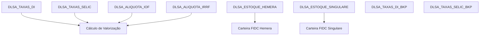

# Taxas de Mercado e Estoque FIDC — Banco Legado

Domínio de dados de **mercado financeiro** e **posição de carteira** dos FIDCs (Fundos de Investimento em Direitos Creditórios) geridos ou administrados pela Sarfaty.

O prefixo `DLSA_` indica Data Lake SA — provavelmente referência à Singulare (administradora de fundos) ou a uma sigla interna para a área de Structured Assets.

## Relações entre tabelas

---

## `DLSA_TAXAS_DI`

**Propósito:** Série histórica diária da **taxa DI** (Depósitos Interbancários) — principal benchmark de renda fixa no Brasil. Usada para calcular valorização de debêntures indexadas ao CDI/DI.

| Coluna | Tipo | Nulável | Descrição |
|--------|------|---------|-----------|
| `Data` | `date` | sim | Data de referência do índice. |
| `Valor` | `decimal(18,6)` | sim | Valor do DI diário (taxa acumulada do dia, 6 casas decimais). |
| `DLDB_ID` | `int` | sim | ID de rastreabilidade interna no Data Lake. |

**Observação:** A taxa DI é publicada pela B3 diariamente após as 20h. Valor típico: `0.000532` (equivalente a ~13% a.a.).

---

## `DLSA_TAXAS_DI_BKP`

**Propósito:** Backup/cópia de segurança da tabela `DLSA_TAXAS_DI`. Mesma estrutura — utilizada para auditoria e recuperação.

Estrutura idêntica a `DLSA_TAXAS_DI`.

---

## `DLSA_TAXAS_SELIC`

**Propósito:** Série histórica diária da **taxa SELIC** — taxa básica de juros da economia brasileira, definida pelo COPOM/BACEN. Indexador de alguns produtos financeiros.

| Coluna | Tipo | Nulável | Descrição |
|--------|------|---------|-----------|
| `Data` | `date` | sim | Data de referência. |
| `Valor` | `decimal(18,6)` | sim | Fator diário da SELIC (6 casas decimais). |
| `DLDB_ID` | `int` | sim | ID de rastreabilidade. |

---

## `DLSA_TAXAS_SELIC_BKP`

**Propósito:** Backup da tabela `DLSA_TAXAS_SELIC`. Mesma estrutura.

---

## `DLSA_ALIQUOTA_IOF`

**Propósito:** Tabela regressiva de **alíquotas de IOF** (Imposto sobre Operações Financeiras) para renda fixa. A alíquota diminui com o tempo — chega a 0% após 30 dias corridos. Utilizada para calcular o IOF no momento de resgates de debêntures.

| Coluna | Tipo | Nulável | Descrição |
|--------|------|---------|-----------|
| `Dias_Corridos` | `int` | sim | Número de dias corridos desde a aplicação (0 a 30). |
| `Aliquota_Percentual` | `decimal(5,4)` | sim | Alíquota de IOF em % (ex: `0.9600` = 96% para D+1, `0.0000` para D+30). |

**Observação:** Tabela estática com 30 linhas (dias 1 a 30). Após 30 dias, IOF = 0%. Definida pela Receita Federal — raramente muda.

---

## `DLSA_ALIQUOTA_IRRF`

**Propósito:** Tabela regressiva de **alíquotas de IRRF** (Imposto de Renda Retido na Fonte) para renda fixa. A alíquota diminui com o prazo da aplicação. Utilizada para calcular o IR no momento de resgates.

| Coluna | Tipo | Nulável | Descrição |
|--------|------|---------|-----------|
| `Dias_Corridos` | `int` | sim | Número de dias corridos da aplicação. |
| `Aliquota_Percentual` | `decimal(5,4)` | sim | Alíquota de IR em % por faixa de prazo. |

**Tabela de referência (Receita Federal — renda fixa):**

| Prazo | Alíquota |
|-------|----------|
| Até 180 dias | 22,5% |
| 181 a 360 dias | 20,0% |
| 361 a 720 dias | 17,5% |
| Acima de 720 dias | 15,0% |

**Observação:** Tabela estática definida por legislação. Raramente alterada.

---

## `DLSA_ESTOQUE_HEMERA`

**Propósito:** Posição diária da carteira de recebíveis do **FIDC Hemera** — fundo de investimento administrado em parceria com a Hemera Capital. Registra cada título na carteira com seus valores e situação de PDD (Provisão para Devedores Duvidosos).

| Coluna | Tipo | Nulável | Descrição |
|--------|------|---------|-----------|
| `Situacao` | `nvarchar(255)` | sim | Situação do título: `A Vencer`, `Vencido`, `Liquidado`, `Inadimplente`. |
| `CedenteTipoInscricao` | `nvarchar(255)` | sim | Tipo do cedente: `CNPJ` ou `CPF`. |
| `CedenteCnpjCpf` | `nvarchar(255)` | sim | CNPJ/CPF do cedente. |
| `CedenteNome` | `nvarchar(255)` | sim | Nome/razão social do cedente. |
| `NotaPDD` | `nvarchar(255)` | sim | Nota de PDD do cedente (ex: `AA`, `A`, `B`, `C`, `D`, `E`). |
| `SacadoTipoInscricao` | `nvarchar(255)` | sim | Tipo do sacado: `CNPJ` ou `CPF`. |
| `SacadoCnpjCpf` | `nvarchar(255)` | sim | CNPJ/CPF do sacado. |
| `SacadoNome` | `nvarchar(255)` | sim | Nome do sacado. |
| `IdTituloVx` | `nvarchar(255)` | sim | ID do título no sistema Vadu/Vx. |
| `TipoAtivo` | `nvarchar(255)` | sim | Tipo: `Duplicata`, `CCB`, `NF-e`, `Cheque`. |
| `DataEmissao` | `date` | sim | Data de emissão do título. |
| `DataAquisicao` | `date` | sim | Data em que o FIDC adquiriu o título. |
| `DataVencimento` | `date` | sim | Data de vencimento original. |
| `NumeroBoletoBanco` | `nvarchar(255)` | sim | Número do boleto de cobrança bancária. |
| `NumeroTitulo` | `nvarchar(255)` | sim | Número do título (nota fiscal, duplicata). |
| `CampoChave` | `nvarchar(255)` | sim | Chave única do título no sistema. |
| `CMC7` | `nvarchar(255)` | sim | Código magnético de cheque (para títulos do tipo cheque). |
| `ValorAquisicao` | `float` | sim | Valor pago pelo FIDC na aquisição (valor descontado). |
| `ValorNominalOriginal` | `float` | sim | Valor de face original do título. |
| `ValorNominalAtual` | `float` | sim | Valor nominal atual (pode diferir do original por prorrogações). |
| `ValorPresente` | `float` | sim | Valor presente calculado (VPL). |
| `PDDNota` | `float` | sim | Valor de PDD pela nota do cedente. |
| `PDDVencido` | `float` | sim | Valor de PDD por inadimplência (vencido). |
| `DataPosicao` | `date` | sim | Data de referência da posição (D). |
| `DataProrrogacao` | `date` | sim | Data de prorrogação do vencimento, se houver. |
| `DataOcorrenciaProrrogacao` | `date` | sim | Data em que a prorrogação foi registrada. |
| `Coobrigacao` | `nvarchar(255)` | sim | Indica se há coobrigação do cedente: `Sim` ou `Não`. |
| `OriginadorCpfCnpj` | `nvarchar(255)` | sim | CNPJ/CPF do originador (quando diferente do cedente). |
| `EmpresaConveniadaCnpj` | `nvarchar(255)` | sim | CNPJ da empresa conveniada (para operações estruturadas). |
| `SubTipoAtivo` | `nvarchar(255)` | sim | Subtipo do ativo (ex: `Duplicata Escritural`, `NF-e`). |
| `Cnae` | `nvarchar(255)` | sim | CNAE do cedente. |
| `ValorPresenteMTM` | `float` | sim | Valor presente marcado a mercado (MTM). |
| `NomeArquivo` | `varchar(255)` | sim | Nome do arquivo de posição importado. |
| `DLDB_ID` | `int` | sim | ID de rastreabilidade no Data Lake. |

**Observação:** Campos `float` são problemáticos para valores financeiros — na migração, converter para `numeric(18,4)`.

---

## `DLSA_ESTOQUE_SINGULARE`

**Propósito:** Posição diária da carteira do **FIDC Singulare** — fundo administrado pela Singulare (antiga SOCOPA). Estrutura similar ao Hemera com nomenclatura diferente.

| Coluna | Tipo | Nulável | Descrição |
|--------|------|---------|-----------|
| `NOME_FUNDO` | `nvarchar(255)` | sim | Nome do fundo (ex: `FIDC SARFATY I`). |
| `DOC_FUNDO` | `nvarchar(255)` | sim | CNPJ do fundo. |
| `DATA_FUNDO` | `date` | sim | Data de referência da posição. |
| `NOME_ORIGINADOR` | `nvarchar(255)` | sim | Nome do originador. |
| `DOC_ORIGINADOR` | `nvarchar(255)` | sim | CNPJ do originador. |
| `NOME_CEDENTE` | `nvarchar(255)` | sim | Nome do cedente. |
| `DOC_CEDENTE` | `nvarchar(255)` | sim | CNPJ/CPF do cedente. |
| `NOME_SACADO` | `nvarchar(255)` | sim | Nome do sacado. |
| `DOC_SACADO` | `nvarchar(255)` | sim | CNPJ/CPF do sacado. |
| `SEU_NUMERO` | `nvarchar(255)` | sim | Número do título no sistema do cedente. |
| `NU_DOCUMENTO` | `nvarchar(255)` | sim | Número do documento (nota fiscal, duplicata). |
| `TIPO_RECEBIVEL` | `nvarchar(255)` | sim | Tipo: `DUP` (Duplicata), `CCB`, `NF`, `CH` (Cheque). |
| `VALOR_NOMINAL` | `decimal(9,2)` | sim | Valor nominal do título. |
| `VALOR_PRESENTE` | `decimal(9,2)` | sim | Valor presente calculado. |
| `VALOR_AQUISICAO` | `decimal(9,2)` | sim | Valor de aquisição pelo fundo. |
| `VALOR_PDD` | `decimal(9,2)` | sim | Valor de provisão para devedores duvidosos. |
| `FAIXA_PDD` | `nvarchar(255)` | sim | Faixa de PDD (ex: `AA`, `A`, `B`, `C`, `D`). |
| `DATA_REFERENCIA` | `date` | sim | Data de referência. |
| `DATA_VENCIMENTO_ORIGI` | `date` | sim | Vencimento original. |
| `DATA_VENCIMENTO_ADJUS` | `date` | sim | Vencimento ajustado (após prorrogação). |
| `DATA_EMISSAO` | `date` | sim | Data de emissão. |
| `DATA_AQUISICAO` | `date` | sim | Data de aquisição. |
| `PRAZO` | `nvarchar(255)` | sim | Prazo original em dias. |
| `PRAZO_ATUAL` | `nvarchar(255)` | sim | Prazo atual (dias a vencer). |
| `SITUACAO_RECEBIVEL` | `nvarchar(255)` | sim | Situação: `A Vencer`, `Vencido`, `Liquidado`. |
| `TAXA_CESSAO` | `nvarchar(255)` | sim | Taxa de cessão do título (% a.a.). |
| `TX_RECEBIVEL` | `nvarchar(255)` | sim | Taxa do recebível original. |
| `COOBRIGACAO` | `nvarchar(255)` | sim | Coobrigação: `S` ou `N`. |
| `DLDB_ID` | `int` | sim | ID de rastreabilidade. |

---

## Observações de migração

1. **Taxas como série temporal:** `DLSA_TAXAS_DI` e `DLSA_TAXAS_SELIC` são séries temporais diárias com volume crescente. No novo sistema, usar uma tabela única `market_rates` com coluna `rate_type` (enum `DI | SELIC | OUTRO`), particionada por data.

2. **Tabelas de alíquota são estáticas:** `DLSA_ALIQUOTA_IOF` e `DLSA_ALIQUOTA_IRRF` raramente mudam (definidas por lei). Podem ser seed data fixo em vez de tabelas migradas ativamente.

3. **Float para valores financeiros:** `DLSA_ESTOQUE_HEMERA` usa `float` para valores monetários — erro de design legado. Na migração, todos os valores financeiros devem ser `numeric(18,4)`.

4. **Dois fundos, dois schemas:** Hemera e Singulare têm esquemas similares mas com nomenclatura e campos ligeiramente diferentes. No novo sistema, unificar em uma tabela `portfolio_positions` com coluna `fund_name` ou `fund_id`.

5. **Backup tables:** `DLSA_TAXAS_DI_BKP` e `DLSA_TAXAS_SELIC_BKP` não devem ser migradas — são artefatos operacionais do legado. O novo sistema deve ter estratégia de backup via PostgreSQL nativo.

6. **PDD:** os campos de PDD (nota e valor) são calculados — no novo sistema podem ser campos derivados ou uma tabela separada de `credit_provisions` atualizada periodicamente.
