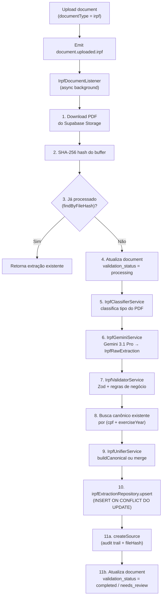

# Agente IA — Extração de IRPF dos Sócios

**Versão:** 1.0  
**Data:** 24 de Fevereiro de 2026  
**Status:** Extração com LLM (Gemini), Classificação, Unificação, API e Interface concluídos  
**Referência:** `spec_tecnico_modulo_comercial.md`

---

## 1. Visão Geral

Este documento descreve a implementação do Agente de IA responsável pela leitura e extração automatizada de dados da Declaração de Imposto de Renda Pessoa Física (IRPF) e de seus respectivos recibos de entrega. O sistema utiliza o modelo `gemini-3-1-pro` (Google Generative AI) para processar PDFs e estruturar os dados extraídos.

### 1.1 Conceito de Registro Canônico

A peça central do design é o **registro canônico**: uma única entrada na tabela `irpf_extractions` por combinação `(cpf, exercise_year)`. Quando um sócio envia sua declaração e seu recibo em arquivos separados — o que é o cenário mais comum — o sistema mescla inteligentemente os dados dos dois PDFs nesse único registro, preservando a declaração como fonte de verdade para dados financeiros e o recibo como fonte para dados de protocolo.

### 1.2 Escopo Implementado

- **Pipeline de extração assíncrono** — acionado por evento `document.uploaded.irpf`, não bloqueia o fluxo de upload
- **Classificador de documento** — identifica se o PDF é uma declaração, um recibo ou ambos
- **Extração via Gemini** — prompt estruturado com JSON Schema forçado via `responseJsonSchema`
- **Validação de negócio** — verificação de consistência financeira (base tributável, saldo de imposto, etc.)
- **Pipeline de merge** — 4 estratégias de mesclagem com registro de conflitos
- **Idempotência por hash SHA-256** — reenvio do mesmo arquivo não reprocessa
- **Audit trail** — tabela `irpf_extraction_sources` vincula cada extração aos documentos originais
- **Checklist dinâmico** — 1 item de IRPF por sócio por ano, gerado via função SQL
- **API REST** — listagem, detalhe e reprocessamento manual
- **Frontend** — aba IRPF na página de detalhe do cliente com exibição de conflitos

### 1.3 Escopo Pendente

- Exibição detalhada das listas (dependentes, bens, dívidas, rendimentos) no frontend
- Comparativo entre exercícios na aba IRPF
- Exportação dos dados extraídos para análise de crédito automatizada

---

## 2. Banco de Dados — Migrations e Schemas Drizzle

**Diretório de schemas:** `apps/api/src/database/schema/`

### 2.1 `irpf_extractions` (irpf-extractions.ts)

Armazena o registro canônico e unificado do IRPF de um CPF para um determinado ano de exercício.

| Campo | Tipo | Descrição |
|-------|------|-----------|
| `id` | uuid | PK gerado automaticamente |
| `client_id` | uuid | FK → `clients` (cascade delete) |
| `authorized_person_id` | uuid | FK → `client_authorized_persons` (set null) |
| `cpf` | text | CPF do declarante (11 dígitos, sem formatação) |
| `exercise_year` | integer | Ano de exercício (ex: 2025) |
| `calendar_year` | integer | Ano-calendário da declaração (ex: 2024) |
| `full_name` | text | Nome completo extraído |
| `birth_date` | date | Data de nascimento |
| `occupation` | text | Ocupação principal |
| `occupation_code` | text | Código de ocupação (Receita Federal) |
| `nationality` | text | Nacionalidade |
| `naturality` | text | Naturalidade (cidade/estado) |
| `phone` | text | Telefone extraído |
| `email` | text | E-mail extraído |
| `address_*` | text | Endereço completo (rua, número, complemento, bairro, cidade, estado, CEP) |
| `spouse_name` | text | Nome do cônjuge |
| `spouse_cpf` | text | CPF do cônjuge |
| `declaration_type` | text | `'original'` \| `'rectifying'` |
| `taxation_option` | text | `'deductions'` \| `'simplified'` |
| `receipt_number` | text | Número do recibo de entrega |
| `delivery_timestamp` | timestamp | Data/hora de entrega à Receita |
| `total_taxable_income` | numeric(18,2) | Rendimento tributável total |
| `total_exempt_income` | numeric(18,2) | Rendimento isento total |
| `total_exclusive_income` | numeric(18,2) | Rendimento exclusivo/definitivo total |
| `total_deductions` | numeric(18,2) | Total de deduções |
| `taxable_base` | numeric(18,2) | Base de cálculo do imposto |
| `tax_due` | numeric(18,2) | Imposto devido |
| `tax_paid` | numeric(18,2) | Imposto já pago/retido |
| `tax_refund` | numeric(18,2) | Valor a restituir |
| `tax_balance` | numeric(18,2) | Valor a pagar |
| `total_assets_current_year` | numeric(18,2) | Patrimônio bruto (ano atual) |
| `total_assets_previous_year` | numeric(18,2) | Patrimônio bruto (ano anterior) |
| `total_debts_current_year` | numeric(18,2) | Dívidas totais (ano atual) |
| `total_debts_previous_year` | numeric(18,2) | Dívidas totais (ano anterior) |
| `dependents` | jsonb | Array de `IrpfDependent` |
| `taxable_income_items` | jsonb | Array de `IrpfIncomeItem` |
| `exempt_income_items` | jsonb | Array de `IrpfExemptIncomeItem` |
| `exclusive_income_items` | jsonb | Array de `IrpfExclusiveIncomeItem` |
| `payments` | jsonb | Array de `IrpfPayment` (pagamentos e deduções) |
| `assets` | jsonb | Array de `IrpfAsset` (bens e direitos) |
| `debts` | jsonb | Array de `IrpfDebt` (dívidas e ônus reais) |
| `extraction_status` | text | `pending` \| `processing` \| `completed` \| `failed` \| `needs_review` |
| `extraction_confidence` | text | `high` \| `medium` \| `low` |
| `ocr_applied` | boolean | Se OCR foi necessário (PDF sem camada de texto) |
| `needs_review` | boolean | Flag de revisão manual |
| `conflicts` | jsonb | Array de `IrpfConflict` — divergências entre recibo e declaração |
| `extraction_log` | jsonb | Log de metadados da última extração/merge |

**Constraints e índices:**

| Tipo | Coluna(s) | Nome |
|------|-----------|------|
| UNIQUE | `(cpf, exercise_year)` | `uq_irpf_cpf_exercise` |
| INDEX | `client_id` | `idx_irpf_extractions_client` |
| INDEX | `cpf` | `idx_irpf_extractions_cpf` |
| INDEX | `exercise_year` | `idx_irpf_extractions_exercise` |
| INDEX | `extraction_status` | `idx_irpf_extractions_status` |
| INDEX | `needs_review` | `idx_irpf_extractions_needs_review` |

### 2.2 `irpf_extraction_sources` (irpf-extraction-sources.ts)

Tabela de audit trail. Relaciona cada extração canônica aos documentos físicos (PDFs) que contribuíram com seus dados.

| Campo | Tipo | Descrição |
|-------|------|-----------|
| `id` | uuid | PK |
| `extraction_id` | uuid | FK → `irpf_extractions` (cascade delete) |
| `document_id` | uuid | FK → `client_documents` (cascade delete) |
| `document_subtype` | text | `'receipt'` \| `'declaration'` \| `'unknown'` |
| `file_hash` | text | SHA-256 do PDF original — base da idempotência |
| `page_count` | integer | Número de páginas do PDF |
| `ocr_applied` | boolean | Se OCR foi aplicado neste documento |
| `ocr_quality` | numeric(5,2) | Score de qualidade do OCR (0–100) |

### 2.3 Migration — Checklist Dinâmico por Sócio (20260224000000)

**Arquivo:** `supabase/migrations/20260224000000_irpf_checklist_per_partner.sql`

Recria as funções `get_document_checklist` e `can_submit_for_analysis` para gerar **um item de IRPF por sócio por ano de exercício** (ano atual e anterior), em vez de um único item estático.

A lógica de geração dos itens de IRPF utiliza `CROSS JOIN` entre `client_authorized_persons` (filtrando `authorization_type = 'partner'` e `is_active = true`) e uma subquery que retorna os dois anos relevantes. O match com documentos existentes em `client_documents` é feito por `(client_id, document_type = 'irpf', partner_name, reference_year)`.

---

## 3. Tipos e Schemas Compartilhados

### 3.1 `@nexus/types`

**Arquivo:** `packages/types/src/irpf.ts`

| Export | Tipo | Valores |
|--------|------|---------|
| `IrpfExtractionStatus` | union | `'pending' \| 'processing' \| 'completed' \| 'failed' \| 'needs_review'` |
| `IrpfConfidenceLevel` | union | `'high' \| 'medium' \| 'low'` |
| `IrpfConflict` | interface | `field`, `receiptValue`, `declarationValue`, `resolvedValue`, `resolvedSource`, `needsReview` |

### 3.2 `@nexus/validators`

**Arquivo:** `packages/validators/src/irpf.schema.ts`

| Schema | Campos principais |
|--------|-------------------|
| `irpfRawExtractionSchema` | Schema raiz — todos os campos extraídos pelo Gemini |
| `irpfDependentSchema` | `name`, `cpf`, `birthDate`, `relationship` |
| `irpfIncomeItemSchema` | `sourceName`, `sourceCnpj`, `grossIncome`, `taxWithheld`, `socialSecurity`, `thirteenthSalary` |
| `irpfExemptIncomeItemSchema` | `code`, `description`, `beneficiaryName`, `beneficiaryCpfCnpj`, `amount` |
| `irpfExclusiveIncomeItemSchema` | `code`, `description`, `beneficiaryName`, `beneficiaryCpfCnpj`, `amount` |
| `irpfPaymentSchema` | `code`, `description`, `beneficiaryName`, `beneficiaryCpfCnpj`, `amount`, `refundAmount` |
| `irpfAssetSchema` | `groupCode`, `itemCode`, `description`, `situation`, `valuePreviousYear`, `valueCurrentYear` |
| `irpfDebtSchema` | `code`, `description`, `creditorName`, `creditorCpfCnpj`, `valuePreviousYear`, `valueCurrentYear` |
| `irpfConflictSchema` | `field`, `receiptValue`, `declarationValue`, `resolvedValue`, `resolvedSource`, `needsReview` |
| `irpfFieldEvidenceSchema` | `field`, `value`, `source`, `confidence`, `page`, `lineSnippet` |

O `irpfRawExtractionSchema` também inclui o campo `confidence` (`'high' \| 'medium' \| 'low'`) e `evidence` (array de `irpfFieldEvidenceSchema`) que o modelo preenche para rastrear a origem de cada valor extraído.

---

## 4. Módulo NestJS — `clients`

Toda a lógica reside no módulo `clients`, que encapsula a IA em adaptadores de infraestrutura, mantendo o domínio limpo.

### 4.1 Estrutura DDD

```
modules/clients/
├── clients.module.ts
├── controllers/
│   └── irpf.controller.ts                       # GET list, GET by id, POST reprocess
├── use-cases/
│   ├── process-irpf-document.use-case.ts         # Orquestra o pipeline completo (11 steps)
│   └── get-irpf-extraction.use-case.ts           # Consulta de extrações por cliente ou ID
├── domain/
│   ├── irpf-extraction.entity.ts                 # IrpfExtractionProps + métodos de negócio
│   └── irpf-extraction.repository.ts             # Interface (upsert, findBy*, createSource)
├── infra/
│   ├── gemini/
│   │   ├── irpf-gemini.service.ts                # Comunicação com Google Generative AI
│   │   └── irpf-gemini-schema.ts                 # Prompt + JSON Schema (derivado do Zod)
│   ├── irpf-classifier.service.ts                # Classifica tipo do documento via pdf-parse
│   ├── irpf-validator.service.ts                 # Validação Zod + regras de consistência financeira
│   ├── irpf-unifier.service.ts                   # Orquestra criação ou merge do canônico
│   ├── irpf-canonical-builder.ts                 # Monta o objeto canônico para novo registro
│   ├── irpf-merge-helpers.ts                     # 4 funções puras de merge (identificação, protocolo, financeiro, listas)
│   ├── drizzle-irpf-extraction.repository.ts     # Implementação Drizzle do repository
│   └── mappers/
│       └── irpf-extraction.mapper.ts             # DB row ↔ IrpfExtractionProps ↔ response HTTP
└── listeners/
    └── irpf-document.listener.ts                 # @OnEvent('document.uploaded.irpf', { async: true })
```

### 4.2 Entity — `IrpfExtraction`

| Método | Retorno | Descrição |
|--------|---------|-----------|
| `toProps()` | `IrpfExtractionProps` | Serialização do estado interno |
| `hasConflictRequiringReview()` | `boolean` | `true` se algum conflito tem `needsReview = true` |
| `isComplete()` | `boolean` | CPF válido + anos preenchidos + `totalTaxableIncome` presente |
| `hasValidYearConsistency()` | `boolean` | `exerciseYear === calendarYear + 1` |

### 4.3 `IrpfClassifierService`

Lê a camada de texto nativa do PDF usando `pdf-parse`. Busca as âncoras textuais:

| Âncora | Tipo detectado |
|--------|----------------|
| `"RECIBO DE ENTREGA"` | `receipt` |
| `"DECLARAÇÃO DE AJUSTE ANUAL"` ou `"DECLARACAO DE AJUSTE ANUAL"` | `declaration` |
| Ambas presentes | `both` |
| Nenhuma (ou texto < 100 chars) | `unknown` + `hasNativeText: false` (aciona fallback OCR no prompt) |

### 4.4 `IrpfGeminiService`

- Modelo: `gemini-3-1-pro`
- Modo de resposta: `application/json` com `responseJsonSchema` derivado de `irpfRawExtractionSchema` via `zod-to-json-schema`
- Temperatura: `0` (determinístico)
- O PDF é enviado como `inlineData` em Base64 com `mimeType: 'application/pdf'`
- O prompt contextualiza o tipo de documento identificado pelo classificador
- Em caso de falha na validação Zod da resposta, usa `.catch()` com todos os campos `null` e `confidence: 'low'` em vez de lançar exceção

### 4.5 `IrpfValidatorService`

Além da validação de schema Zod, verifica 3 regras de consistência financeira:

| Regra | Aviso gerado |
|-------|--------------|
| `totalTaxableIncome - totalDeductions ≠ taxableBase` (tolerância: R$ 1,00) | `taxable_base_mismatch` |
| `taxDue - taxPaid ≠ taxBalance` (tolerância: R$ 1,00) | `tax_balance_mismatch` |
| `taxRefund > 0` e `taxBalance > 0` simultaneamente | `tax_refund_and_balance_both_positive` |

A **confiança final** é calculada pela função `resolveConfidence`:
- `high`: confiança Gemini = `'high'` **e** zero avisos de negócio
- `low`: confiança Gemini = `'low'` **ou** mais de 2 avisos
- `medium`: demais casos

### 4.6 `IrpfDocumentListener`

Escuta o evento `document.uploaded.irpf` emitido pelo `UploadDocumentUseCase` quando `documentType === 'irpf'`. A opção `{ async: true }` garante que o listener é executado em background, sem bloquear a resposta HTTP do upload.

Erros no listener são capturados e logados sem re-throw para evitar que falhas de IA interrompam o fluxo do usuário.

---

## 5. Pipeline de Extração — 11 Passos



| Step | Responsável | Detalhe |
|------|------------|---------|
| 1 | `ClientStorageService` | Download do PDF do bucket `client-documents` |
| 2 | `node:crypto` | SHA-256 do buffer para chave de idempotência |
| 3 | `IrpfExtractionRepository.findByFileHash` | Evita reprocessamento do mesmo arquivo |
| 4 | `ClientDocumentRepository.updateExtraction` | Sinaliza que o processamento iniciou |
| 5 | `IrpfClassifierService.classify` | Detecção por âncoras textuais via `pdf-parse` |
| 6 | `IrpfGeminiService.extract` | Chamada ao Gemini com PDF em Base64 + prompt |
| 7 | `IrpfValidatorService.validate` | Zod + 3 regras de consistência financeira |
| 8 | `IrpfExtractionRepository.findByCpfAndExercise` | Verifica se já existe um canônico para o sócio/ano |
| 9 | `IrpfUnifierService.buildCanonical` | Cria novo canônico ou executa merge com existente |
| 10 | `IrpfExtractionRepository.upsert` | Upsert com conflict target `(cpf, exercise_year)` |
| 11a | `IrpfExtractionRepository.createSource` | Registra documento fonte com hash e metadados |
| 11b | `ClientDocumentRepository.updateExtraction` | Status final: `valid` ou `needs_review` |

Em caso de erro em qualquer step após o passo 4, o status do documento é atualizado para `invalid`.

---

## 6. Lógica de Merge — `irpf-merge-helpers.ts`

Quando já existe um registro canônico para `(cpf, exercise_year)`, o `IrpfUnifierService` executa o `runMergePipeline`, que aplica 4 estratégias de merge em sequência.

### 6.1 Estratégias

| Estratégia | Função | Campos | Regra |
|-----------|--------|--------|-------|
| Identificação | `mergeIdentificationFields` | `fullName`, `birthDate`, `occupation`, endereço, cônjuge, etc. (17 campos) | Preenche campos nulos do canônico a partir do novo documento. **Nunca sobrescreve** valor existente. |
| Protocolo | `mergeProtocolFields` | `receiptNumber`, `deliveryTimestamp` | O **recibo** é a fonte de verdade. Registra conflito em `conflicts` se `receiptNumber` divergir. |
| Financeiro | `mergeFinancialFields` | Todos os 13 totalizadores (rendimentos, imposto, patrimônio) | Preenche nulos; se valor existente diverge do novo: registra `IrpfConflict`. `needsReview = true` se diferença > R$ 100,00. A **declaração** é a fonte resolvida. |
| Listas | `mergeListFields` | `dependents`, `assets`, `debts`, `taxableIncomeItems`, etc. | Preenche apenas se a lista do canônico está **vazia**. Não faz merge item a item. |

### 6.2 Estrutura de `IrpfConflict`

```typescript
interface IrpfConflict {
  field: string;              // Nome do campo em conflito
  receiptValue: unknown;      // Valor vindo do recibo
  declarationValue: unknown;  // Valor vindo da declaração
  resolvedValue: unknown;     // Valor escolhido para o canônico
  resolvedSource: 'receipt' | 'declaration';
  needsReview: boolean;       // true se divergência financeira > R$ 100,00
}
```

### 6.3 Definição de `needsReview` no canônico

O campo `needsReview` na tabela `irpf_extractions` é `true` se:
- Algum `IrpfConflict` tem `needsReview = true` (divergência financeira > R$ 100,00), **ou**
- O `IrpfValidationResult.isValid` é `false` (falha no schema Zod)

---

## 7. API Endpoints

**Controller:** `apps/api/src/modules/clients/controllers/irpf.controller.ts`  
**Base URL:** `/clients/:clientId/irpf-extractions`

| Método | Endpoint | Roles | Descrição |
|--------|----------|-------|-----------|
| GET | `/clients/:clientId/irpf-extractions` | `credit_analyst`, `compliance_officer`, `approver`, `backoffice`, `risk_manager`, `legal`, `admin` | Lista todas as extrações do cliente |
| GET | `/clients/:clientId/irpf-extractions/:extractionId` | (mesmo acima) | Detalhe de uma extração específica |
| POST | `/clients/:clientId/irpf-extractions/:documentId/reprocess` | `credit_analyst`, `compliance_officer`, `admin` | Agenda reprocessamento assíncrono de um documento (fire-and-forget). Retorna `202 Accepted`. |

**Resposta padrão (listagem e detalhe):**
```json
{
  "data": [IrpfExtractionResponse]
}
```

O mapper `IrpfExtractionMapper.toResponse` exclui campos de log interno e serializa `conflicts` e os arrays JSONB.

---

## 8. Frontend — Web Backoffice

**App:** `apps/web-backoffice` (Next.js 15, App Router)

### 8.1 Localização

```
app/(dashboard)/clients/[id]/
└── _components/
    ├── client-detail.tsx         # Adiciona tab "IRPF" (value="irpf")
    └── tabs/
        └── client-irpf-tab.tsx  # Componente principal da aba
```

### 8.2 `ClientIrpfTab`

Carrega os dados via `GET /clients/:clientId/irpf-extractions` no `useEffect` inicial. Cada extração é renderizada como um `IrpfExtractionCard` expansível (accordion).

**Status de extração exibidos:**

| Status | Label | Badge |
|--------|-------|-------|
| `pending` | Aguardando | Secondary |
| `processing` | Processando | Secondary |
| `completed` | Concluído | Verde (`bg-green-600`) |
| `failed` | Falhou | Destructive |
| `needs_review` | Revisar | Outline amarelo (`border-yellow-500`) |

**Campos financeiros exibidos (com label em pt-BR):**

| Campo | Label |
|-------|-------|
| `totalTaxableIncome` | Rendimento Tributável |
| `totalExemptIncome` | Rendimento Isento |
| `totalExclusiveIncome` | Rendimento Exclusivo |
| `totalDeductions` | Deduções |
| `taxableBase` | Base de Cálculo |
| `taxDue` | Imposto Devido |
| `taxPaid` | Imposto Pago |
| `taxRefund` | A Restituir |
| `taxBalance` | A Pagar |
| `totalAssetsCurrentYear` | Patrimônio (ano atual) |
| `totalAssetsPreviousYear` | Patrimônio (ano anterior) |
| `receiptNumber` | Nº do Recibo |

**Reprocessamento:**

O botão "Reprocessar" aparece apenas para extrações com status `failed` ou `needs_review`. Ao clicar, faz `POST /clients/:clientId/irpf-extractions/:documentId/reprocess` (202 Accepted), exibe toast de confirmação e atualiza a listagem localmente com status `processing`. O processamento real ocorre em background no servidor.

**Conflitos:**

Se `conflicts` contém itens com `needsReview = true`, um badge amarelo com ícone `AlertTriangle` exibe a contagem. O card expansível mostra cada conflito com os valores do recibo e da declaração lado a lado.

---

## 9. Configurações e Variáveis de Ambiente

**Arquivo de validação:** `apps/api/src/config/env.ts`

```env
GEMINI_API_KEY=sua_chave_api_do_google_ai_studio
```

Esta variável é lida diretamente pelo `IrpfGeminiService` via `process.env.GEMINI_API_KEY`. A ausência da variável causa uma exceção no bootstrap da aplicação com a mensagem `GEMINI_API_KEY environment variable is not set`.

O modelo utilizado é `gemini-3-1-pro`. A instância do cliente `GoogleGenAI` é criada no construtor do serviço e reutilizada em todas as chamadas.
